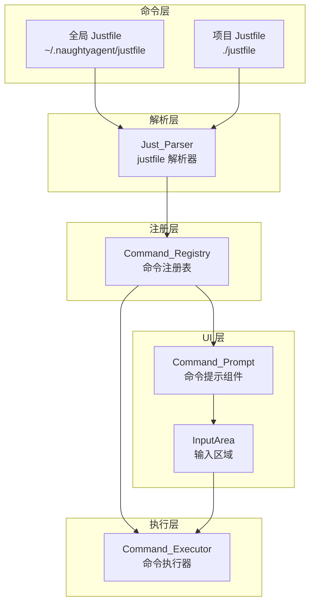
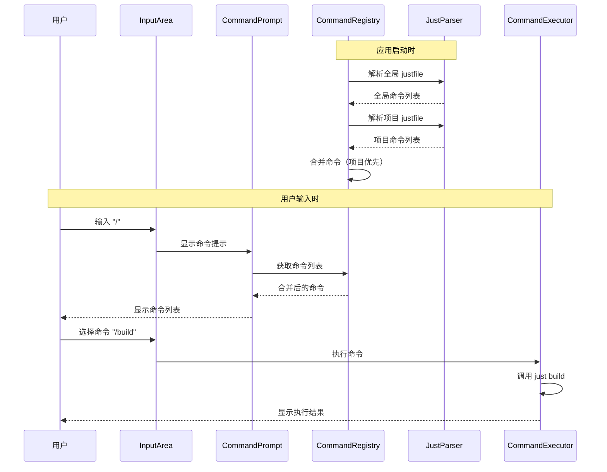

# 设计文档

## 概述

本设计文档描述了 NaughtyAgent 全局 justfile 命令系统的技术实现方案。该系统提供统一的命令管理机制，支持全局命令（`~/.naughtyagent/justfile`）和项目命令（`./justfile`）的发现、解析、合并和执行，并在 Ink 终端 UI 中提供命令输入提示功能。

### 设计目标

1. **无缝集成**: 与现有 Ink UI 组件和命令系统无缝集成
2. **优先级清晰**: 项目命令覆盖同名全局命令
3. **用户友好**: 输入 `/` 后显示可用命令的智能提示
4. **容错性强**: 解析错误不影响系统正常运行
5. **可扩展**: 支持未来添加更多命令来源

## 架构

### 系统架构图



### 数据流



## 组件和接口

### 1. Just_Parser（justfile 解析器）

负责解析 justfile 文件，提取命令信息。

```typescript
// packages/agent/src/justfile/parser.ts

/**
 * 解析后的命令信息
 */
interface JustCommand {
  /** 命令名称 */
  name: string
  /** 命令描述（从注释提取） */
  description: string
  /** 命令参数列表 */
  parameters: JustParameter[]
  /** 命令体（实际执行的脚本） */
  body: string[]
  /** 是否为私有命令（以 _ 开头） */
  isPrivate: boolean
  /** 是否为默认命令 */
  isDefault: boolean
  /** 依赖的其他命令 */
  dependencies: string[]
  /** 原始行号（用于错误报告） */
  lineNumber: number
}

/**
 * 命令参数
 */
interface JustParameter {
  /** 参数名称 */
  name: string
  /** 是否有默认值 */
  hasDefault: boolean
  /** 默认值 */
  defaultValue?: string
}

/**
 * 解析结果
 */
interface ParseResult {
  /** 解析成功的命令列表 */
  commands: JustCommand[]
  /** 解析错误列表 */
  errors: ParseError[]
}

/**
 * 解析错误
 */
interface ParseError {
  /** 错误消息 */
  message: string
  /** 行号 */
  line: number
  /** 列号 */
  column?: number
}

/**
 * 解析 justfile 内容
 */
function parseJustfile(content: string): ParseResult

/**
 * 从文件路径解析 justfile
 */
async function parseJustfileFromPath(filePath: string): Promise<ParseResult>
```

### 2. Command_Registry（命令注册表）

管理全局和项目命令的发现、合并和查询。

```typescript
// packages/agent/src/justfile/registry.ts

/**
 * 命令来源
 */
type CommandSource = 'global' | 'project'

/**
 * 注册的命令（包含来源信息）
 */
interface RegisteredCommand extends JustCommand {
  /** 命令来源 */
  source: CommandSource
  /** 来源文件路径 */
  sourcePath: string
}

/**
 * 命令注册表配置
 */
interface RegistryConfig {
  /** 全局 justfile 路径 */
  globalPath: string
  /** 项目 justfile 路径 */
  projectPath: string
  /** 是否监听文件变化 */
  watchChanges?: boolean
}

/**
 * 命令注册表接口
 */
interface CommandRegistry {
  /** 获取所有命令（已合并） */
  getCommands(): RegisteredCommand[]
  
  /** 根据名称获取命令 */
  getCommand(name: string): RegisteredCommand | undefined
  
  /** 搜索命令（模糊匹配） */
  searchCommands(query: string): RegisteredCommand[]
  
  /** 重新加载命令 */
  reload(): Promise<void>
  
  /** 重新加载项目命令 */
  reloadProject(projectPath: string): Promise<void>
  
  /** 获取加载错误 */
  getErrors(): { global: ParseError[]; project: ParseError[] }
}

/**
 * 创建命令注册表
 */
function createCommandRegistry(config: RegistryConfig): CommandRegistry
```

### 3. Command_Prompt（命令提示组件）

在用户输入 `/` 时显示可用命令列表的 UI 组件。

```typescript
// packages/agent/src/cli/ink/components/CommandPrompt.tsx

/**
 * 命令提示组件 Props
 */
interface CommandPromptProps {
  /** 命令列表 */
  commands: RegisteredCommand[]
  /** 当前输入的过滤文本 */
  filter: string
  /** 选中命令回调 */
  onSelect: (command: RegisteredCommand) => void
  /** 关闭回调 */
  onClose: () => void
  /** 是否可见 */
  visible: boolean
}

/**
 * 命令提示组件
 * 
 * 显示可用命令的下拉列表，支持：
 * - 模糊搜索过滤
 * - 键盘导航（上/下方向键）
 * - Enter 选择
 * - Escape 关闭
 */
function CommandPrompt(props: CommandPromptProps): React.ReactElement
```

### 4. Command_Executor（命令执行器）

负责执行 justfile 命令。

```typescript
// packages/agent/src/justfile/executor.ts

/**
 * 执行选项
 */
interface ExecuteOptions {
  /** 工作目录 */
  cwd: string
  /** 命令参数 */
  args?: string[]
  /** 超时时间（毫秒） */
  timeout?: number
  /** 环境变量 */
  env?: Record<string, string>
}

/**
 * 执行结果
 */
interface ExecuteResult {
  /** 是否成功 */
  success: boolean
  /** 标准输出 */
  stdout: string
  /** 标准错误 */
  stderr: string
  /** 退出码 */
  exitCode: number
  /** 执行时间（毫秒） */
  duration: number
}

/**
 * 命令执行器接口
 */
interface CommandExecutor {
  /** 执行命令 */
  execute(command: RegisteredCommand, options: ExecuteOptions): Promise<ExecuteResult>
  
  /** 检查 just 是否可用 */
  isJustAvailable(): Promise<boolean>
}

/**
 * 创建命令执行器
 */
function createCommandExecutor(): CommandExecutor
```

### 5. Install_Script（安装脚本）

构建后自动安装默认全局 justfile。

```typescript
// packages/agent/scripts/install-justfile.ts

/**
 * 安装选项
 */
interface InstallOptions {
  /** 是否强制覆盖 */
  force?: boolean
  /** 目标目录 */
  targetDir?: string
}

/**
 * 安装结果
 */
interface InstallResult {
  /** 是否成功 */
  success: boolean
  /** 消息 */
  message: string
  /** 安装路径 */
  installedPath?: string
}

/**
 * 安装默认全局 justfile
 */
async function installGlobalJustfile(options?: InstallOptions): Promise<InstallResult>
```

## 数据模型

### 命令数据结构

```typescript
/**
 * 完整的命令信息（用于 UI 显示）
 */
interface CommandInfo {
  /** 命令名称 */
  name: string
  /** 命令描述 */
  description: string
  /** 命令来源 */
  source: 'global' | 'project'
  /** 来源图标 */
  sourceIcon: '🌐' | '📁'
  /** 参数信息 */
  parameters: {
    name: string
    required: boolean
    defaultValue?: string
  }[]
  /** 是否为默认命令 */
  isDefault: boolean
}
```

### 配置文件结构

```typescript
/**
 * 全局配置（~/.naughtyagent/config.json）
 */
interface GlobalConfig {
  /** justfile 相关配置 */
  justfile?: {
    /** 是否启用全局命令 */
    enabled?: boolean
    /** 自定义全局 justfile 路径 */
    customPath?: string
  }
}
```

### 默认全局 Justfile 模板

```just
# NaughtyAgent 全局命令
# 这些命令在任意目录下都可用

# 默认命令：显示帮助
default:
    @just --list

# ============================================
# 系统命令
# ============================================

# 显示 NaughtyAgent 版本
version:
    @naughty --version

# 打开配置文件
config:
    @${EDITOR:-code} ~/.naughtyagent/config.json

# 检查更新
update:
    @echo "检查 NaughtyAgent 更新..."
    @npm view naughtyagent version

# 显示帮助信息
help:
    @echo "NaughtyAgent 全局命令"
    @echo ""
    @just --list
```


## 正确性属性

*正确性属性是一种应该在系统所有有效执行中保持为真的特征或行为——本质上是关于系统应该做什么的形式化陈述。属性作为人类可读规范和机器可验证正确性保证之间的桥梁。*

### Property 1: Justfile 加载一致性

*对于任意* 有效的 justfile 文件路径和内容，从该路径加载后返回的命令列表应该与文件中定义的命令一一对应。

**Validates: Requirements 1.1, 2.1**

### Property 2: 解析器往返一致性

*对于任意* 有效的 justfile 内容，解析后的命令信息（名称、描述、参数）应该能够准确反映原始文件中的定义。具体来说：
- 命令名称应与定义行的名称完全匹配
- 命令描述应与紧邻命令定义上方的注释内容匹配
- 命令参数应与定义行中的参数列表匹配

**Validates: Requirements 1.5, 2.5, 5.1, 5.2, 5.3, 5.5**

### Property 3: 私有命令过滤

*对于任意* 包含私有命令（以 `_` 开头）的 justfile，解析后返回的公开命令列表不应包含任何私有命令。

**Validates: Requirements 5.4**

### Property 4: 默认命令标识

*对于任意* 包含 `default` 命令的 justfile，解析后该命令应被正确标记为默认命令（`isDefault: true`）。

**Validates: Requirements 5.6**

### Property 5: 命令合并优先级

*对于任意* 全局命令列表和项目命令列表，合并后的结果应满足：
- 当存在同名命令时，项目命令覆盖全局命令
- 合并后的列表包含所有唯一命令名称
- 每个命令都有正确的来源标注（global/project）

**Validates: Requirements 3.1, 3.2, 3.3**

### Property 6: 命令合并顺序保持

*对于任意* 全局命令列表和项目命令列表，合并后的命令顺序应为：全局命令在前，项目命令在后，同名命令只保留项目版本。

**Validates: Requirements 3.4**

### Property 7: 模糊搜索过滤

*对于任意* 命令列表和搜索查询字符串，过滤后的结果应只包含名称或描述中包含查询字符串（不区分大小写）的命令。

**Validates: Requirements 4.3**

### Property 8: 命令显示完整性

*对于任意* 注册的命令，其显示信息应包含：命令名称、描述、来源标识（🌐/📁）和参数信息（如果有）。

**Validates: Requirements 4.2, 4.7**

### Property 9: 解析错误处理

*对于任意* 格式错误的 justfile 内容，解析器应返回包含错误信息的结果，而不是抛出异常。错误信息应包含行号和错误描述。

**Validates: Requirements 1.4, 5.7**

## 错误处理

### 文件系统错误

| 错误场景 | 处理方式 |
|---------|---------|
| 全局 justfile 不存在 | 返回空命令列表，不报错 |
| 项目 justfile 不存在 | 返回空命令列表，不报错 |
| 文件读取权限不足 | 记录警告日志，返回空列表 |
| 文件编码错误 | 记录警告日志，返回空列表 |

### 解析错误

| 错误场景 | 处理方式 |
|---------|---------|
| 语法错误 | 记录警告，跳过错误行，继续解析 |
| 无效命令名称 | 记录警告，跳过该命令 |
| 参数格式错误 | 记录警告，使用空参数列表 |

### 执行错误

| 错误场景 | 处理方式 |
|---------|---------|
| just 命令不可用 | 显示安装提示 |
| 命令执行超时 | 终止进程，显示超时错误 |
| 命令执行失败 | 显示退出码和错误输出 |
| 参数缺失 | 提示用户输入必需参数 |

## 测试策略

### 单元测试

1. **Just_Parser 测试**
   - 解析简单命令
   - 解析带参数的命令
   - 解析带注释的命令
   - 解析多行命令体
   - 解析私有命令（验证过滤）
   - 解析 default 命令
   - 处理格式错误

2. **Command_Registry 测试**
   - 加载全局命令
   - 加载项目命令
   - 合并命令（优先级测试）
   - 搜索命令（模糊匹配）
   - 处理文件不存在

3. **Command_Executor 测试**
   - 执行简单命令
   - 执行带参数的命令
   - 处理执行超时
   - 处理执行失败

### 属性测试

使用 fast-check 进行属性测试，每个属性至少运行 100 次迭代：

1. **解析器属性测试**
   - 生成随机有效的 justfile 内容
   - 验证解析结果的完整性和正确性

2. **合并属性测试**
   - 生成随机的全局和项目命令列表
   - 验证合并逻辑的正确性

3. **搜索属性测试**
   - 生成随机命令列表和搜索词
   - 验证过滤结果的正确性

### 测试配置

```typescript
// vitest.config.ts 中的属性测试配置
{
  test: {
    // 属性测试最小迭代次数
    fuzz: {
      iterations: 100
    }
  }
}
```

### 测试标签格式

每个属性测试必须包含以下标签注释：

```typescript
/**
 * Feature: global-justfile-commands
 * Property 1: Justfile 加载一致性
 * Validates: Requirements 1.1, 2.1
 */
```
