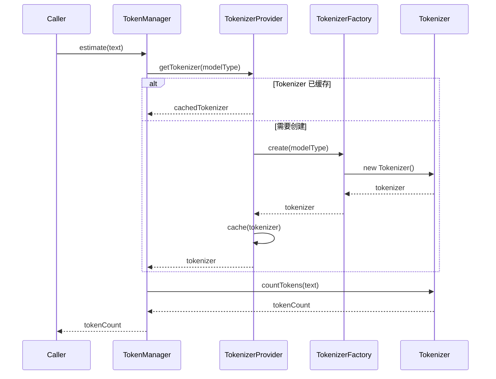
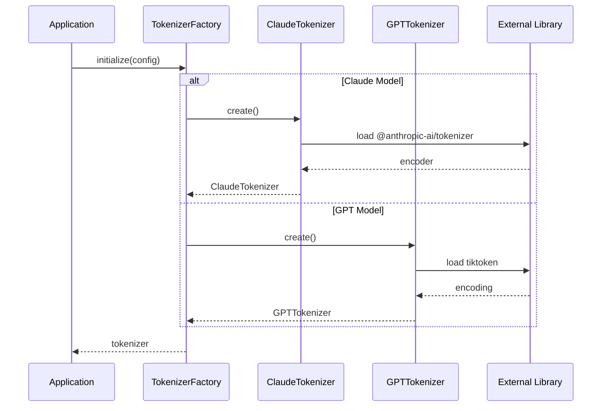

# Design Document: Token 精确计数

## Overview

Token 精确计数功能旨在替换 NaughtyAgent 现有的字符估算方法，通过集成专业的 tokenizer 库（tiktoken 或 @anthropic-ai/tokenizer）实现精确的 token 计数。该功能将支持 Claude 和 GPT 两种模型系列的 tokenizer，同时保持与现有 TokenManager 接口的完全兼容。

当前实现使用简单的字符比例估算（英文 4 字符/token，中文 1.5 字符/token），误差可达 10-20%。精确计数将显著提升上下文管理的准确性，避免因估算偏差导致的上下文截断过早或溢出问题。

## Architecture

```mermaid
graph TD
    subgraph "Token 计数系统"
        TM[TokenManager] --> TP[TokenizerProvider]
        TP --> TF[TokenizerFactory]
        TF --> CT[ClaudeTokenizer]
        TF --> GT[GPTTokenizer]
        TF --> ET[EstimateTokenizer]
        
        CT --> AT[@anthropic-ai/tokenizer]
        GT --> TK[tiktoken]
        ET --> Legacy[字符估算]
    end
    
    subgraph "使用方"
        Compressor[Compressor] --> TM
        Truncator[Truncator] --> TM
        Session[Session] --> TM
    end
    
    subgraph "配置"
        Config[TokenizerConfig] --> TF
        ModelType[ModelType] --> Config
    end
```

## Sequence Diagrams

### Token 计数流程



### Tokenizer 初始化流程



## Components and Interfaces

### Component 1: TokenizerProvider

**Purpose**: 管理 tokenizer 实例的生命周期，提供缓存和懒加载机制

**Interface**:
```typescript
interface TokenizerProvider {
  /** 获取指定模型类型的 tokenizer */
  getTokenizer(modelType: ModelType): Tokenizer
  
  /** 预加载 tokenizer（可选，用于启动时预热） */
  preload(modelTypes: ModelType[]): Promise<void>
  
  /** 清除缓存 */
  clearCache(): void
  
  /** 获取当前缓存状态 */
  getCacheStats(): CacheStats
}
```

**Responsibilities**:
- 根据模型类型选择正确的 tokenizer
- 缓存已创建的 tokenizer 实例
- 支持懒加载以优化启动性能
- 处理 tokenizer 加载失败的回退逻辑

### Component 2: Tokenizer

**Purpose**: 统一的 tokenizer 接口，封装不同库的实现细节

**Interface**:
```typescript
interface Tokenizer {
  /** Tokenizer 类型标识 */
  readonly type: TokenizerType
  
  /** 计算文本的 token 数量 */
  countTokens(text: string): number
  
  /** 将文本编码为 token ID 数组 */
  encode(text: string): number[]
  
  /** 将 token ID 数组解码为文本 */
  decode(tokens: number[]): string
  
  /** 按 token 数量截断文本 */
  truncateToTokens(text: string, maxTokens: number): string
}
```

**Responsibilities**:
- 提供精确的 token 计数
- 支持编码/解码操作
- 提供基于 token 的文本截断

### Component 3: TokenizerFactory

**Purpose**: 创建不同类型的 tokenizer 实例

**Interface**:
```typescript
interface TokenizerFactory {
  /** 创建 tokenizer */
  create(config: TokenizerConfig): Tokenizer
  
  /** 检查指定类型是否可用 */
  isAvailable(type: TokenizerType): boolean
  
  /** 获取支持的 tokenizer 类型列表 */
  getSupportedTypes(): TokenizerType[]
}
```

**Responsibilities**:
- 根据配置创建正确类型的 tokenizer
- 处理库加载和初始化
- 提供可用性检查

## Data Models

### Model 1: TokenizerConfig

```typescript
interface TokenizerConfig {
  /** Tokenizer 类型 */
  type: TokenizerType
  
  /** 模型名称（用于选择正确的编码） */
  modelName?: string
  
  /** 是否启用缓存 */
  enableCache?: boolean
  
  /** 回退策略 */
  fallbackStrategy?: FallbackStrategy
}
```

**Validation Rules**:
- type 必须是支持的 TokenizerType 之一
- modelName 如果提供，必须是有效的模型标识符
- fallbackStrategy 默认为 'estimate'

### Model 2: TokenizerType

```typescript
type TokenizerType = 'claude' | 'gpt' | 'estimate'
```

### Model 3: ModelType

```typescript
type ModelType = 
  | 'claude-3-opus'
  | 'claude-3-sonnet' 
  | 'claude-3-haiku'
  | 'claude-3.5-sonnet'
  | 'claude-4-opus'
  | 'gpt-4'
  | 'gpt-4-turbo'
  | 'gpt-4o'
  | 'gpt-3.5-turbo'
```

### Model 4: CacheStats

```typescript
interface CacheStats {
  /** 缓存的 tokenizer 数量 */
  cachedCount: number
  
  /** 缓存命中次数 */
  hits: number
  
  /** 缓存未命中次数 */
  misses: number
  
  /** 缓存的 tokenizer 类型列表 */
  cachedTypes: TokenizerType[]
}
```

### Model 5: FallbackStrategy

```typescript
type FallbackStrategy = 'estimate' | 'error' | 'none'
```


## Algorithmic Pseudocode

### Main Processing Algorithm: Token 计数

```math
\begin{aligned}
&\textbf{algorithm } countTokens \textbf{ is}\\
&\quad \textbf{input}: text ∈ String, modelType ∈ ModelType\\
&\quad \textbf{output}: count ∈ ℕ\\
&\quad \textbf{precondition}: text ≠ null\\
&\quad \textbf{postcondition}: count ≥ 0 ∧ count = |encode(text)|\\
&\\
&\quad tokenizer ← getTokenizer(modelType)\\
&\quad \textbf{if } tokenizer = ∅ \textbf{ then}\\
&\quad\quad \textbf{return } estimateTokens(text)\\
&\\
&\quad tokens ← tokenizer.encode(text)\\
&\quad \textbf{return } |tokens|
\end{aligned}
```

**Preconditions:**
- text 参数不为 null
- modelType 是有效的模型类型标识符

**Postconditions:**
- 返回值为非负整数
- 返回值等于编码后的 token 数组长度

**Loop Invariants:** N/A

### Tokenizer 获取算法

```math
\begin{aligned}
&\textbf{algorithm } getTokenizer \textbf{ is}\\
&\quad \textbf{input}: modelType ∈ ModelType\\
&\quad \textbf{output}: tokenizer ∈ Tokenizer ∪ \{∅\}\\
&\quad \textbf{precondition}: modelType ∈ \{claude, gpt, estimate\}\\
&\quad \textbf{postcondition}: tokenizer ≠ ∅ ⟹ tokenizer.type = inferType(modelType)\\
&\\
&\quad type ← inferTokenizerType(modelType)\\
&\\
&\quad \textbf{if } cache.has(type) \textbf{ then}\\
&\quad\quad cache.hits ← cache.hits + 1\\
&\quad\quad \textbf{return } cache.get(type)\\
&\\
&\quad cache.misses ← cache.misses + 1\\
&\quad tokenizer ← createTokenizer(type)\\
&\\
&\quad \textbf{if } tokenizer ≠ ∅ \textbf{ then}\\
&\quad\quad cache.set(type, tokenizer)\\
&\\
&\quad \textbf{return } tokenizer
\end{aligned}
```

**Preconditions:**
- modelType 是已定义的模型类型之一

**Postconditions:**
- 如果返回非空，tokenizer 类型与推断的类型匹配
- 缓存统计正确更新

**Loop Invariants:** N/A

### Tokenizer 创建算法

```math
\begin{aligned}
&\textbf{algorithm } createTokenizer \textbf{ is}\\
&\quad \textbf{input}: type ∈ TokenizerType, config ∈ TokenizerConfig\\
&\quad \textbf{output}: tokenizer ∈ Tokenizer ∪ \{∅\}\\
&\quad \textbf{precondition}: type ∈ \{claude, gpt, estimate\}\\
&\quad \textbf{postcondition}: tokenizer ≠ ∅ ⟹ tokenizer.type = type\\
&\\
&\quad \textbf{match } type \textbf{ with}\\
&\quad | claude → \\
&\quad\quad \textbf{try}\\
&\quad\quad\quad encoder ← loadAnthropicTokenizer()\\
&\quad\quad\quad \textbf{return } ClaudeTokenizer(encoder)\\
&\quad\quad \textbf{catch } e →\\
&\quad\quad\quad \textbf{return } handleFallback(config.fallbackStrategy)\\
&\\
&\quad | gpt →\\
&\quad\quad \textbf{try}\\
&\quad\quad\quad encoding ← loadTiktoken(config.modelName)\\
&\quad\quad\quad \textbf{return } GPTTokenizer(encoding)\\
&\quad\quad \textbf{catch } e →\\
&\quad\quad\quad \textbf{return } handleFallback(config.fallbackStrategy)\\
&\\
&\quad | estimate →\\
&\quad\quad \textbf{return } EstimateTokenizer()
\end{aligned}
```

**Preconditions:**
- type 是有效的 TokenizerType
- config 包含必要的配置信息

**Postconditions:**
- 成功时返回正确类型的 tokenizer
- 失败时根据 fallbackStrategy 处理

**Loop Invariants:** N/A

### 文本截断算法

```math
\begin{aligned}
&\textbf{algorithm } truncateToTokens \textbf{ is}\\
&\quad \textbf{input}: text ∈ String, maxTokens ∈ ℕ\\
&\quad \textbf{output}: truncated ∈ String\\
&\quad \textbf{precondition}: text ≠ null ∧ maxTokens > 0\\
&\quad \textbf{postcondition}: countTokens(truncated) ≤ maxTokens\\
&\\
&\quad tokens ← encode(text)\\
&\\
&\quad \textbf{if } |tokens| ≤ maxTokens \textbf{ then}\\
&\quad\quad \textbf{return } text\\
&\\
&\quad truncatedTokens ← tokens[0..maxTokens]\\
&\quad \textbf{return } decode(truncatedTokens)
\end{aligned}
```

**Preconditions:**
- text 不为 null
- maxTokens 为正整数

**Postconditions:**
- 返回文本的 token 数不超过 maxTokens
- 如果原文本 token 数不超过限制，返回原文本

**Loop Invariants:** N/A

### 模型类型推断算法

```math
\begin{aligned}
&\textbf{algorithm } inferTokenizerType \textbf{ is}\\
&\quad \textbf{input}: modelType ∈ ModelType\\
&\quad \textbf{output}: type ∈ TokenizerType\\
&\quad \textbf{precondition}: modelType ∈ ValidModelTypes\\
&\quad \textbf{postcondition}: type ∈ \{claude, gpt, estimate\}\\
&\\
&\quad \textbf{if } modelType \text{ starts with } "claude" \textbf{ then}\\
&\quad\quad \textbf{return } claude\\
&\\
&\quad \textbf{if } modelType \text{ starts with } "gpt" \textbf{ then}\\
&\quad\quad \textbf{return } gpt\\
&\\
&\quad \textbf{return } estimate
\end{aligned}
```

**Preconditions:**
- modelType 是有效的模型类型字符串

**Postconditions:**
- 返回值是三种 TokenizerType 之一
- Claude 模型返回 'claude'，GPT 模型返回 'gpt'，其他返回 'estimate'

**Loop Invariants:** N/A

## Key Functions with Formal Specifications

### Function 1: countTokens()

```typescript
function countTokens(text: string, modelType?: ModelType): number
```

**Preconditions:**
- `text` 是有效字符串（可以为空）
- `modelType` 如果提供，必须是有效的 ModelType

**Postconditions:**
- 返回非负整数
- 空字符串返回 0
- 返回值等于实际 token 数量（精确模式）或估算值（回退模式）

**Loop Invariants:** N/A

### Function 2: getTokenizer()

```typescript
function getTokenizer(modelType: ModelType): Tokenizer | null
```

**Preconditions:**
- `modelType` 是有效的 ModelType

**Postconditions:**
- 返回匹配的 Tokenizer 实例或 null
- 如果返回非 null，tokenizer.type 与推断类型匹配
- 缓存命中/未命中计数正确更新

**Loop Invariants:** N/A

### Function 3: encode()

```typescript
function encode(text: string): number[]
```

**Preconditions:**
- `text` 是有效字符串

**Postconditions:**
- 返回 token ID 数组
- 空字符串返回空数组
- decode(encode(text)) 应产生等效文本

**Loop Invariants:** N/A

### Function 4: decode()

```typescript
function decode(tokens: number[]): string
```

**Preconditions:**
- `tokens` 是有效的 token ID 数组
- 所有 token ID 在有效范围内

**Postconditions:**
- 返回解码后的字符串
- 空数组返回空字符串

**Loop Invariants:** N/A

### Function 5: truncateToTokens()

```typescript
function truncateToTokens(text: string, maxTokens: number): string
```

**Preconditions:**
- `text` 是有效字符串
- `maxTokens` 是正整数

**Postconditions:**
- 返回字符串的 token 数 ≤ maxTokens
- 如果原文本 token 数 ≤ maxTokens，返回原文本
- 截断发生在 token 边界

**Loop Invariants:** N/A


## Example Usage

```typescript
// Example 1: 基本 token 计数
import { createTokenManager } from './token'

const tokenManager = createTokenManager({
  tokenizerType: 'claude',
  modelName: 'claude-3.5-sonnet'
})

const text = "Hello, 你好世界！"
const count = tokenManager.estimate(text)
console.log(`Token count: ${count}`)

// Example 2: 使用不同模型的 tokenizer
const claudeCount = tokenManager.estimate(text, 'claude-3.5-sonnet')
const gptCount = tokenManager.estimate(text, 'gpt-4')

// Example 3: 文本截断
const longText = "这是一段很长的文本..."
const truncated = tokenManager.truncateToTokens(longText, 100)

// Example 4: 消息 token 计数
const messages: Message[] = [
  { role: 'user', content: [{ type: 'text', text: '你好' }] },
  { role: 'assistant', content: [{ type: 'text', text: '你好！有什么可以帮助你的？' }] }
]
const totalTokens = tokenManager.countMessages(messages)

// Example 5: 完整上下文计数
const context = {
  system: "你是一个有帮助的助手。",
  messages,
  tools: [{ name: 'search', description: '搜索工具', parameters: {} }]
}
const tokenCount = tokenManager.countContext(context)
console.log(`Total: ${tokenCount.total}, System: ${tokenCount.system}, Messages: ${tokenCount.messages}`)

// Example 6: 预加载 tokenizer（可选优化）
await tokenManager.preload(['claude', 'gpt'])

// Example 7: 回退到估算模式
const fallbackManager = createTokenManager({
  tokenizerType: 'claude',
  fallbackStrategy: 'estimate'  // 如果 Claude tokenizer 加载失败，回退到估算
})
```

## Error Handling

### Error Scenario 1: Tokenizer 库加载失败

**Condition**: @anthropic-ai/tokenizer 或 tiktoken 库无法加载（未安装或版本不兼容）
**Response**: 根据 fallbackStrategy 配置处理：
- 'estimate': 回退到字符估算方法
- 'error': 抛出 TokenizerLoadError
- 'none': 返回 null，由调用方处理
**Recovery**: 使用估算方法继续运行，记录警告日志

### Error Scenario 2: 无效的 Token ID

**Condition**: decode() 接收到无效的 token ID 数组
**Response**: 抛出 InvalidTokenError，包含无效的 token ID
**Recovery**: 调用方应验证 token ID 来源，或使用 try-catch 处理

### Error Scenario 3: 内存不足

**Condition**: 处理超大文本时内存不足
**Response**: 抛出 OutOfMemoryError
**Recovery**: 建议分块处理大文本，或增加内存限制

### Error Scenario 4: 不支持的模型类型

**Condition**: 传入未知的 modelType
**Response**: 回退到 'estimate' tokenizer，记录警告
**Recovery**: 系统继续运行，使用估算方法

## Testing Strategy

### Unit Testing Approach

- 测试每个 tokenizer 实现的 countTokens、encode、decode 方法
- 测试边界情况：空字符串、超长文本、特殊字符
- 测试缓存机制的正确性
- 测试回退策略的触发和执行
- 覆盖目标：语句 80%，分支 75%，函数 85%

### Property-Based Testing Approach

**Property Test Library**: fast-check

- 使用 fast-check 生成随机文本进行 round-trip 测试
- 验证 encode/decode 的一致性
- 验证 token 计数的单调性（更长文本 ≥ 更多 token）

### Integration Testing Approach

- 测试与现有 Compressor、Truncator 的集成
- 测试 TokenManager 接口的向后兼容性
- 测试不同模型类型切换的正确性

## Performance Considerations

### 缓存策略

- Tokenizer 实例按类型缓存，避免重复初始化
- 缓存大小有限，使用 LRU 策略（如果需要）
- 预加载选项用于启动时预热

### 内存使用

- tiktoken 和 @anthropic-ai/tokenizer 的词汇表会占用内存
- 估算：每个 tokenizer 约 10-50MB
- 建议：只加载实际使用的 tokenizer 类型

### 计算性能

- 精确计数比估算慢约 10-100 倍
- 对于频繁调用的场景，考虑批量处理
- 短文本（<1000 字符）性能影响可忽略

## Security Considerations

### 输入验证

- 验证输入文本不包含恶意内容
- 限制单次处理的文本长度
- 防止 DoS 攻击（超大输入）

### 依赖安全

- 定期更新 tiktoken 和 @anthropic-ai/tokenizer
- 验证依赖包的完整性
- 监控安全公告

## Dependencies

### 必需依赖

| 包名 | 版本 | 用途 |
|------|------|------|
| tiktoken | ^1.0.0 | GPT 系列模型的 tokenizer |
| @anthropic-ai/tokenizer | ^0.0.4 | Claude 系列模型的 tokenizer |

### 可选依赖

| 包名 | 版本 | 用途 |
|------|------|------|
| lru-cache | ^10.0.0 | 可选的 LRU 缓存实现 |

### 现有依赖（无需修改）

- zod: Schema 验证
- TypeScript: 类型系统


## Correctness Properties

*属性是应该在系统所有有效执行中保持为真的特征或行为——本质上是关于系统应该做什么的形式化陈述。属性作为人类可读规格和机器可验证正确性保证之间的桥梁。*

### Property 1: Encode/Decode Round-Trip

*For any* 有效文本字符串，对其执行 encode 后再 decode，应该产生与原文本等效的结果。

**Validates: Requirements 3.3**

### Property 2: Token 计数一致性

*For any* 有效文本字符串，countTokens 方法返回的值应该等于 encode 方法返回的 token ID 数组的长度。

**Validates: Requirements 1.1, 1.3**

### Property 3: 截断上限保证

*For any* 文本字符串和正整数 maxTokens，truncateToTokens 方法返回的文本的 token 数应该小于等于 maxTokens。

**Validates: Requirements 4.1, 4.4**

### Property 4: 截断幂等性

*For any* 文本字符串，如果其 token 数不超过 maxTokens，则 truncateToTokens 应该返回原文本不变。

**Validates: Requirements 4.2**

### Property 5: 模型类型推断正确性

*For any* 模型名称字符串，如果以 "claude" 开头则返回 Claude tokenizer，如果以 "gpt" 开头则返回 GPT tokenizer，否则返回 Estimate tokenizer。

**Validates: Requirements 2.4, 2.5, 2.6**

### Property 6: 缓存实例一致性

*For any* tokenizer 类型，多次请求同一类型的 tokenizer 应该返回同一个实例（引用相等）。

**Validates: Requirements 5.1, 5.2**

### Property 7: 无效 Token ID 错误处理

*For any* 包含无效 token ID 的数组，decode 方法应该抛出 InvalidTokenError。

**Validates: Requirements 3.6, 10.2**

### Property 8: 消息 Token 计数累加性

*For any* 消息数组，countMessages 返回的总 token 数应该等于各消息 token 数之和。

**Validates: Requirements 9.1, 9.4**

### Property 9: 上下文计数完整性

*For any* 上下文对象，countContext 返回的 total 字段应该等于 system + messages 字段之和。

**Validates: Requirements 9.2, 9.3**

### Property 10: 估算比例正确性

*For any* 纯英文文本，估算模式的 token 数应该约等于字符数除以 4；*For any* 纯中文文本，估算模式的 token 数应该约等于字符数除以 1.5。

**Validates: Requirements 6.5**
