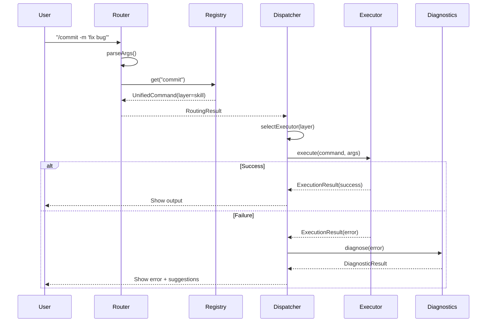
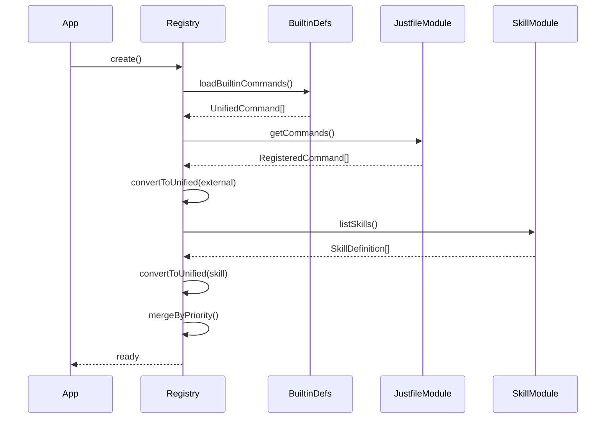

# Design Document: Unified Command System

## Overview

统一命令系统采用"统一入口，分层执行"的架构设计。用户通过 `/` 前缀访问所有命令，系统内部根据命令层级（Builtin/External/Skill）路由到对应执行器。

核心设计原则：
- **统一发现**: 用户只看到一个命令列表，无需关心底层实现
- **分层执行**: 不同类型命令有不同执行模式（同步/子进程/AI工作流）
- **复用现有**: 整合已有的 justfile 和 skill 模块，不重复实现
- **可扩展**: 未来可添加新层（如 MCP prompts）

## Architecture

```
┌─────────────────────────────────────────────────────────────────┐
│                        User Input                                │
│                    "/"开头 or 自然语言                           │
└─────────────────────────────────────────────────────────────────┘
                                │
                                ▼
┌─────────────────────────────────────────────────────────────────┐
│                      Command Router                              │
│              解析输入 → 命令 or 自然语言                         │
└─────────────────────────────────────────────────────────────────┘
                                │
              ┌─────────────────┼─────────────────┐
              ▼                 ▼                 ▼
┌───────────────────┐ ┌───────────────────┐ ┌───────────────────┐
│   Builtin Layer   │ │  External Layer   │ │   Skill Layer     │
│   ⚡ 同步执行     │ │  📁 子进程执行    │ │  🤖 AI Workflow   │
│                   │ │                   │ │                   │
│ /help /clear      │ │ justfile commands │ │ /commit /pr       │
│ /model /mode      │ │ global + project  │ │ /review /test     │
│ /history /exit    │ │                   │ │                   │
└───────────────────┘ └───────────────────┘ └───────────────────┘
        │                     │                     │
        │              (复用 src/justfile/)   (复用 src/skill/)
        │                     │                     │
        └─────────────────────┼─────────────────────┘
                              ▼
┌─────────────────────────────────────────────────────────────────┐
│                    Command Dispatcher                            │
│              根据 layer 分发到对应 Executor                      │
└─────────────────────────────────────────────────────────────────┘
                              │
                              ▼
┌─────────────────────────────────────────────────────────────────┐
│                    Unified Registry                              │
│         聚合三层命令 → 统一发现 + 搜索 + 补全                    │
└─────────────────────────────────────────────────────────────────┘
                              │
              ┌───────────────┼───────────────┐
              ▼               ▼               ▼
┌───────────────────┐ ┌───────────────────┐ ┌───────────────────┐
│ Error Diagnostics │ │Completion Provider│ │   Agent (NL)      │
│   错误分析+建议   │ │   命令补全        │ │   自然语言处理    │
└───────────────────┘ └───────────────────┘ └───────────────────┘
```

## Components and Interfaces

### 1. 统一类型定义

```typescript
// src/command/types.ts

/**
 * 命令层级
 */
export type CommandLayer = 'builtin' | 'external' | 'skill'

/**
 * 执行模式
 */
export type ExecutionMode = 'sync' | 'subprocess' | 'workflow'

/**
 * 命令来源
 */
export type CommandSource = 
  | 'builtin'           // 内置
  | 'global-justfile'   // ~/.naughtyagent/justfile
  | 'project-justfile'  // ./justfile
  | 'builtin-skill'     // 内置 skill
  | 'global-skill'      // ~/.naughtyagent/skills/
  | 'project-skill'     // .naughtyagent/skills/

/**
 * 命令参数
 */
export interface CommandParameter {
  name: string
  description?: string
  required: boolean
  defaultValue?: string
}

/**
 * 统一命令接口
 */
export interface UnifiedCommand {
  /** 命令名称（不含 /） */
  name: string
  /** 描述 */
  description: string
  /** 层级 */
  layer: CommandLayer
  /** 执行模式 */
  executionMode: ExecutionMode
  /** 来源 */
  source: CommandSource
  /** 参数 */
  parameters: CommandParameter[]
  /** 来源路径（外部命令） */
  sourcePath?: string
  /** 别名 */
  aliases?: string[]
  
  // Skill 特有属性
  /** 是否禁止 AI 自动调用 */
  disableModelInvocation?: boolean
  /** 上下文模式 */
  contextMode?: 'main' | 'fork'
  /** 允许的工具 */
  allowedTools?: string[]
  /** 指定模型 */
  model?: string
}

/**
 * 层级优先级（数值越小优先级越高）
 */
export const LAYER_PRIORITY: Record<CommandLayer, number> = {
  builtin: 0,
  skill: 1,
  external: 2,
}

/**
 * 层级图标
 */
export const LAYER_ICONS: Record<CommandLayer, string> = {
  builtin: '⚡',
  external: '📁',
  skill: '🤖',
}
```

### 2. 路由结果

```typescript
/**
 * 路由类型
 */
export type RoutingType = 'command' | 'natural-language'

/**
 * 路由结果
 */
export interface RoutingResult {
  type: RoutingType
  /** 命令信息（type='command' 时） */
  command?: UnifiedCommand
  /** 命令名（可能未找到） */
  commandName?: string
  /** 解析的参数 */
  args: string[]
  /** 命名参数 */
  namedArgs: Record<string, string>
  /** 原始输入 */
  rawInput: string
  /** 是否找到命令 */
  found: boolean
}
```

### 3. 执行结果

```typescript
/**
 * 统一执行结果
 */
export interface ExecutionResult {
  /** 是否成功 */
  success: boolean
  /** 输出内容 */
  output: string
  /** 错误信息 */
  error?: string
  /** 执行时间（毫秒） */
  duration: number
  /** 命令层级 */
  layer: CommandLayer
  /** 是否需要退出应用 */
  exit?: boolean
  /** 附加数据 */
  data?: Record<string, unknown>
  
  // Subprocess 特有
  /** 退出码 */
  exitCode?: number
  /** stderr */
  stderr?: string
  
  // Workflow 特有
  /** 执行的步骤 */
  steps?: unknown[]
  /** Token 使用 */
  usage?: { inputTokens: number; outputTokens: number }
}
```

### 4. 统一注册表接口

```typescript
// src/command/registry.ts

export interface UnifiedRegistry {
  /** 获取所有命令 */
  getAll(): UnifiedCommand[]
  
  /** 按层级获取 */
  getByLayer(layer: CommandLayer): UnifiedCommand[]
  
  /** 获取内置命令 */
  getBuiltin(): UnifiedCommand[]
  
  /** 获取外部命令 */
  getExternal(): UnifiedCommand[]
  
  /** 获取技能命令 */
  getSkills(): UnifiedCommand[]
  
  /** 根据名称获取（返回最高优先级） */
  get(name: string): UnifiedCommand | undefined
  
  /** 搜索命令 */
  search(query: string): UnifiedCommand[]
  
  /** 重新加载所有来源 */
  reload(): Promise<void>
  
  /** 获取加载错误 */
  getErrors(): RegistryErrors
}

export interface RegistryErrors {
  justfile: { global: Error[]; project: Error[] }
  skill: { global: Error[]; project: Error[] }
}
```

### 5. 命令路由器接口

```typescript
// src/command/router.ts

export interface CommandRouter {
  /** 路由输入 */
  route(input: string): RoutingResult
  
  /** 检查是否是命令 */
  isCommand(input: string): boolean
  
  /** 解析命令参数 */
  parseArgs(input: string): { name: string; args: string[]; namedArgs: Record<string, string> }
}
```

### 6. 命令调度器接口

```typescript
// src/command/dispatcher.ts

export interface CommandDispatcher {
  /** 执行命令 */
  dispatch(
    command: UnifiedCommand,
    args: string[],
    namedArgs: Record<string, string>,
    context: DispatchContext
  ): Promise<ExecutionResult>
}

export interface DispatchContext {
  /** 工作目录 */
  cwd: string
  /** 取消信号 */
  abort?: AbortSignal
  /** 添加消息回调 */
  addMessage?: (type: 'info' | 'error' | 'warning', message: string) => void
  /** 获取应用状态 */
  getState?: () => AppState
  /** 更新应用状态 */
  setState?: (updates: Partial<AppState>) => void
  /** AI 运行时（Skill 执行需要） */
  aiRuntime?: SkillExecutorRuntime
}
```

### 7. 错误诊断接口

```typescript
// src/command/diagnostics.ts

export type ErrorType = 
  | 'not_found'
  | 'permission_denied'
  | 'timeout'
  | 'dependency_missing'
  | 'syntax_error'
  | 'runtime_error'
  | 'workflow_error'
  | 'unknown'

export interface DiagnosticResult {
  errorType: ErrorType
  message: string
  suggestions: string[]
  recoverable: boolean
  fixAction?: {
    description: string
    command?: string
  }
}

export interface ErrorDiagnostics {
  /** 诊断错误 */
  diagnose(error: Error | string, context: DiagnosticContext): DiagnosticResult
  
  /** 查找相似命令 */
  findSimilar(name: string, registry: UnifiedRegistry): string[]
}

export interface DiagnosticContext {
  command?: string
  layer?: CommandLayer
  args?: string[]
  exitCode?: number
  stderr?: string
  workflowStep?: string
}
```

### 8. 补全提供器接口

```typescript
// src/command/completion.ts

export interface CompletionSuggestion {
  name: string
  description: string
  layer: CommandLayer
  layerIcon: string
  parameterHint?: string
  source: CommandSource
}

export interface CompletionProvider {
  /** 获取补全建议 */
  getSuggestions(input: string, registry: UnifiedRegistry): CompletionSuggestion[]
  
  /** 获取参数补全 */
  getParameterSuggestions(command: UnifiedCommand, currentArg: string): string[]
}
```

## Data Flow

### 命令执行流程



### 注册表加载流程



## Module Structure

```
src/command/                    # 新建：统一命令层
├── types.ts                    # 统一类型定义
├── registry.ts                 # 统一注册表（聚合三层）
├── router.ts                   # 输入路由器
├── dispatcher.ts               # 分层执行调度
├── diagnostics.ts              # 错误诊断
├── completion.ts               # 补全提供器
├── builtin/                    # 内置命令
│   ├── index.ts                # 导出所有内置命令
│   ├── help.ts                 # /help
│   ├── clear.ts                # /clear
│   ├── model.ts                # /model
│   ├── mode.ts                 # /mode
│   ├── history.ts              # /history
│   ├── exit.ts                 # /exit
│   ├── refresh.ts              # /refresh
│   └── config.ts               # /config
└── index.ts                    # 桶导出

src/justfile/                   # 已有：External Layer（复用）
src/skill/                      # 已有：Skill Layer（复用）
```

## Correctness Properties

### Property 1: Layer Aggregation Completeness
*For any* unified registry, getAll() SHALL return commands from all three layers (builtin, external, skill).

**Validates: Requirements 1.1**

### Property 2: Layer Priority Ordering
*For any* set of commands with same name across layers, get(name) SHALL return the highest priority (builtin > skill > external).

**Validates: Requirements 1.5**

### Property 3: Command Metadata Completeness
*For any* command in registry, it SHALL have non-empty name, description, valid layer, valid executionMode, and valid source.

**Validates: Requirements 1.6**

### Property 4: Routing Classification
*For any* input string, if it starts with '/' the router SHALL classify as 'command', otherwise as 'natural-language'.

**Validates: Requirements 5.1, 5.2**

### Property 5: Argument Parsing Preservation
*For any* command input with arguments, parsing SHALL preserve all arguments in order and support quoted strings.

**Validates: Requirements 5.3, 5.4**

### Property 6: Dispatcher Layer Routing
*For any* command, dispatcher SHALL route to correct executor based on layer (builtin→sync, external→subprocess, skill→workflow).

**Validates: Requirements 6.1, 6.2, 6.3**

### Property 7: Execution Result Structure
*For any* command execution, result SHALL contain success, output, duration, and layer fields.

**Validates: Requirements 6.4**

### Property 8: Error Diagnosis Completeness
*For any* error, diagnostics SHALL return valid errorType, non-empty message, and suggestions array.

**Validates: Requirements 7.1, 7.5, 7.6**

### Property 9: Similar Command Suggestions
*For any* 'not_found' error, diagnostics SHALL suggest commands with edit distance <= 3.

**Validates: Requirements 7.2**

### Property 10: Completion Filtering
*For any* partial input, completion SHALL only return commands whose names start with the prefix.

**Validates: Requirements 8.2**

### Property 11: Completion Layer Icons
*For any* completion suggestion, it SHALL include correct layer icon (⚡/📁/🤖).

**Validates: Requirements 8.4**

### Property 12: Builtin Sync Execution
*For any* builtin command, execution SHALL complete synchronously without spawning subprocesses.

**Validates: Requirements 2.10**

### Property 13: External Subprocess Execution
*For any* external command, execution SHALL spawn subprocess via just CLI.

**Validates: Requirements 3.5**

### Property 14: Skill Workflow Execution
*For any* skill command, execution SHALL trigger AI workflow engine.

**Validates: Requirements 4.4**

## Testing Strategy

### 单元测试

1. **Registry Tests** - 命令聚合、优先级、搜索
2. **Router Tests** - 输入分类、参数解析
3. **Dispatcher Tests** - 层级路由、结果格式化
4. **Diagnostics Tests** - 错误分类、相似命令
5. **Completion Tests** - 前缀过滤、图标生成

### 属性测试 (Property-Based)

使用 `fast-check` 验证上述 14 个正确性属性。

### 集成测试（真实 Agent）

**关键：必须启动真实 Agent 实例进行测试**

```typescript
// test/command/integration.test.ts

describe('Command System Integration', () => {
  let agent: Agent
  let registry: UnifiedRegistry
  
  beforeAll(async () => {
    // 启动真实 Agent，使用 mock LLM
    agent = await createTestAgent({
      provider: createMockProvider(),
      cwd: testDir,
    })
    registry = agent.getCommandRegistry()
  })
  
  afterAll(async () => {
    await agent.shutdown()
  })
  
  describe('Builtin Commands', () => {
    it('should execute /help and return all commands', async () => {
      const result = await agent.executeCommand('/help')
      expect(result.success).toBe(true)
      expect(result.output).toContain('/help')
      expect(result.output).toContain('/commit')
    })
    
    it('should execute /model and switch model', async () => {
      const result = await agent.executeCommand('/model claude-sonnet')
      expect(result.success).toBe(true)
      expect(agent.getCurrentModel()).toBe('claude-sonnet')
    })
  })
  
  describe('External Commands', () => {
    it('should execute justfile command via just CLI', async () => {
      // 创建测试 justfile
      await writeFile(join(testDir, 'justfile'), 'test:\n  echo "hello"')
      await registry.reload()
      
      const result = await agent.executeCommand('/test')
      expect(result.success).toBe(true)
      expect(result.output).toContain('hello')
      expect(result.layer).toBe('external')
    })
  })
  
  describe('Skill Commands', () => {
    it('should execute /commit skill with AI workflow', async () => {
      // Mock LLM 返回预设响应
      mockProvider.setResponse('Generated commit message: fix: resolve bug')
      
      const result = await agent.executeCommand('/commit')
      expect(result.success).toBe(true)
      expect(result.layer).toBe('skill')
      expect(result.usage).toBeDefined()
    })
  })
  
  describe('Error Handling', () => {
    it('should suggest similar commands for typos', async () => {
      const result = await agent.executeCommand('/hepl')  // typo
      expect(result.success).toBe(false)
      expect(result.error).toContain('help')  // suggestion
    })
  })
})
```

### Mock Provider 设计

```typescript
// test/helpers/mock-provider.ts

export function createMockProvider(): LLMProvider {
  const responses: string[] = []
  
  return {
    setResponse(response: string) {
      responses.push(response)
    },
    
    async chat(messages) {
      const response = responses.shift() || 'Mock response'
      return {
        content: response,
        usage: { inputTokens: 100, outputTokens: 50 },
      }
    },
    
    async *stream(messages) {
      const response = responses.shift() || 'Mock response'
      yield { type: 'text', content: response }
      yield { type: 'done', usage: { inputTokens: 100, outputTokens: 50 } }
    },
  }
}
```

## Error Handling

| Error Type | Trigger | Recovery |
|------------|---------|----------|
| `not_found` | 命令不存在 | 建议相似命令 |
| `permission_denied` | 权限不足 | 建议 chmod/sudo |
| `timeout` | 执行超时 | 建议增加超时 |
| `dependency_missing` | just 未安装 | 提供安装指令 |
| `syntax_error` | 参数错误 | 显示正确用法 |
| `runtime_error` | 执行失败 | 显示 stderr |
| `workflow_error` | AI 工作流失败 | 显示失败步骤 |

