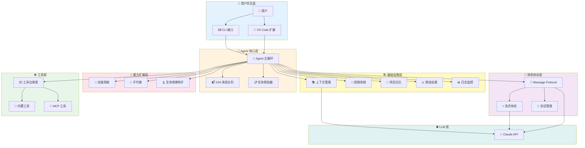
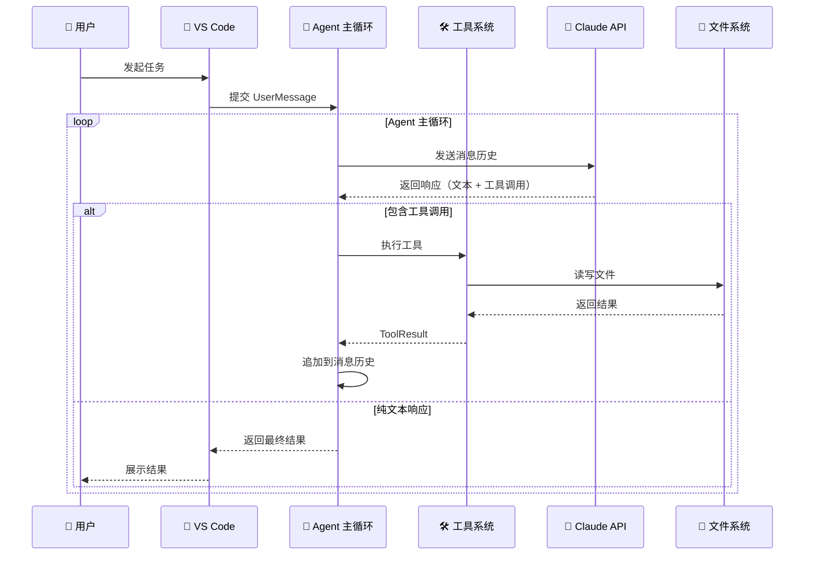
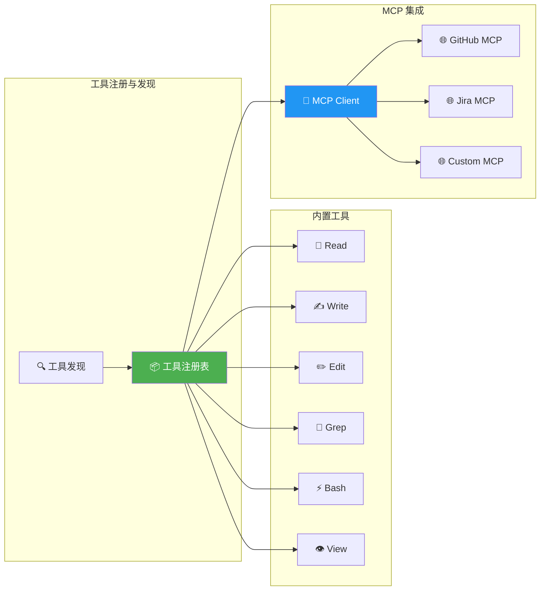
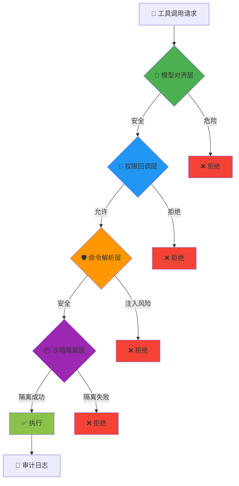
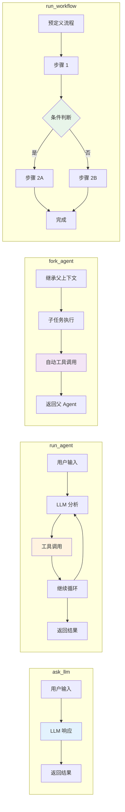
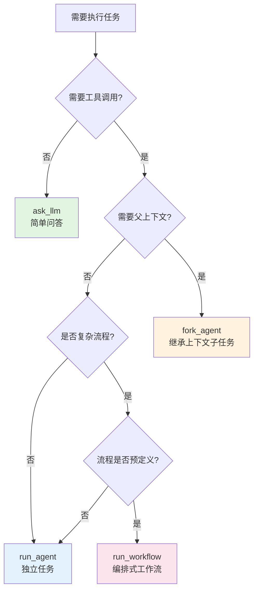
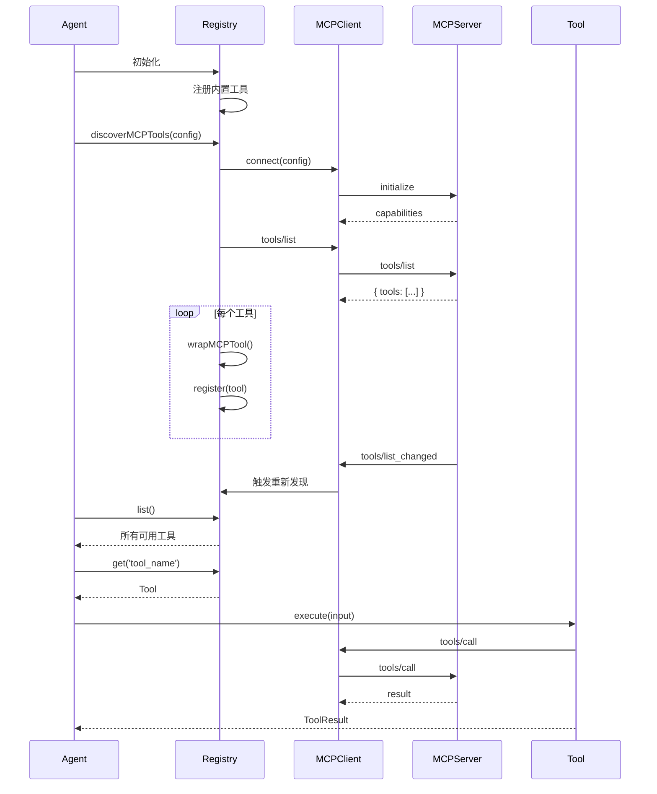
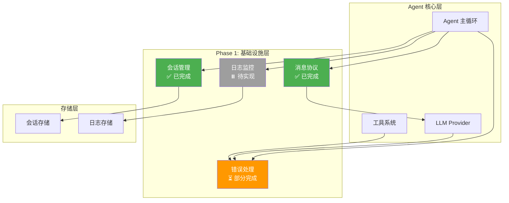
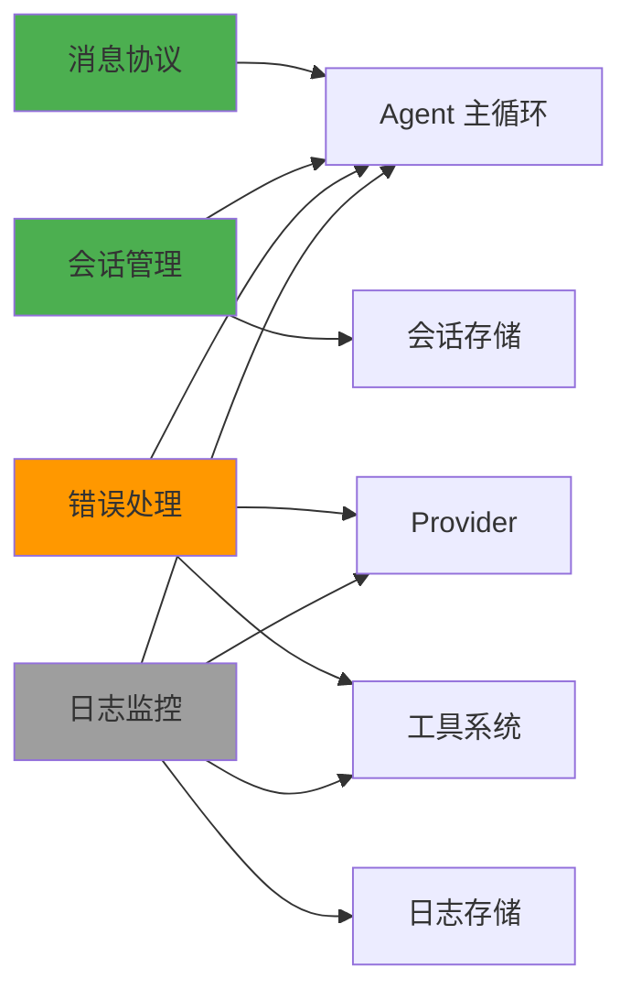

# NaughtyAgent 整体架构设计

> 基于 Claude Agent SDK 的 AI 编程助手架构

## 架构概览

### 整体分层架构



### 核心执行流程



### 工具系统架构



### 权限系统（多层防护）



### Agent 执行模式对比



## 核心设计原则

### 1. 单线程主循环（Single-Threaded Master Loop）

**Who（是什么）**
- 单线程的 Agent 执行引擎，采用经典的 `while(tool_call)` 模式
- 维护一个扁平的消息历史列表，无复杂的线程或多代理竞争

**Why（为什么）**
- **可调试性**：单线程执行路径清晰，易于追踪和调试
- **可控性**：避免多代理混乱，保持行为可预测
- **简单性**：复杂系统建立在简单基础上，"先做简单的事"

**How（怎么实现）**

标准做法：
- LangChain/LangGraph：复杂的图状态机，支持并行节点
- AutoGPT：多代理协作，复杂的任务分解

Claude Agent SDK 做法：
```typescript
// 伪代码展示核心循环
while (true) {
  const response = await claude.chat(messages);
  
  if (response.hasToolCalls()) {
    // 执行工具调用
    const results = await executeTools(response.toolCalls);
    messages.push(results);
    continue; // 继续循环
  } else {
    // 纯文本响应，循环结束
    return response.text;
  }
}
```

执行流程：
```
用户输入 → 模型分析 → 工具调用 → 执行工具 → 结果反馈 → 继续循环 → 最终答案 → 返回用户
```

#### 1.1 Agent 执行模式（Execution Modes）

Claude Agent SDK 提供四种执行模式，适应不同的使用场景：

| 特性 | ask_llm | run_agent | fork_agent | run_workflow |
|------|---------|-----------|------------|--------------|
| **调用方式** | 同步 | 异步 | 异步 | 异步 |
| **会话状态** | 无 | 全新 | 继承父会话 | 全新 |
| **工具调用** | ❌ | ✅ | ✅（自动） | ✅（编排） |
| **多轮对话** | ❌ | ✅ | ✅（自动） | ❌（需预加载） |
| **多轮交互** | ❌ | ❌ | ✅ | ❌ |
| **流程控制** | 无 | max_turns 中止 | max_turns 中高 | condition/repeat_until 自定义 |
| **复杂度** | 最低 | 中 | 中高 | 高 |
| **典型用途** | 快速问答 | 独立任务 | 上下文子任务 | 复杂流程 |

**Who（是什么）**

四种执行模式的详细说明：

1. **ask_llm**：最简单的同步调用
   - 直接调用 LLM，无工具、无循环
   - 适合简单问答、文本生成

2. **run_agent**：标准的 Agent 执行
   - 全新会话，独立上下文
   - 支持工具调用和多轮循环
   - 通过 `max_turns` 限制循环次数

3. **fork_agent**：继承上下文的子 Agent
   - 继承父会话的上下文和状态
   - 自动处理工具调用和多轮对话
   - 适合需要父上下文的子任务

4. **run_workflow**：编排式工作流
   - 预定义的流程控制（条件、循环）
   - 需要预先加载多轮对话
   - 支持复杂的业务逻辑编排

**Why（为什么）**

- **灵活性**：不同场景需要不同的执行策略
- **性能优化**：简单任务用简单模式，避免不必要的开销
- **上下文控制**：精确控制上下文的继承和隔离
- **流程编排**：支持复杂的多步骤工作流

**How（怎么实现）**

```typescript
// 1. ask_llm - 简单问答
async function askLLM(prompt: string): Promise<string> {
  const response = await claude.messages.create({
    model: 'claude-sonnet-4',
    messages: [{ role: 'user', content: prompt }],
    max_tokens: 1024
  });
  return response.content[0].text;
}

// 使用示例
const answer = await askLLM('什么是 TypeScript?');

// 2. run_agent - 独立任务
async function runAgent(task: string, options?: AgentOptions) {
  const agent = new Agent({
    systemPrompt: options?.systemPrompt,
    tools: options?.tools || defaultTools,
    maxTurns: options?.maxTurns || 10
  });
  
  return await agent.run(task);
}

// 使用示例
const result = await runAgent('分析这个项目的依赖关系', {
  tools: ['Read', 'Grep'],
  maxTurns: 5
});

// 3. fork_agent - 子任务（继承上下文）
async function forkAgent(
  parentContext: AgentContext,
  subtask: string
): Promise<AgentResult> {
  const childAgent = new Agent({
    // 继承父上下文
    parentContext: parentContext,
    // 自动继承工具和权限
    inheritTools: true,
    inheritPermissions: true,
    maxTurns: 5
  });
  
  return await childAgent.run(subtask);
}

// 使用示例（在主 Agent 中）
class MainAgent {
  async processTask(task: string) {
    // 主任务处理
    const analysis = await this.analyze(task);
    
    // Fork 子任务，继承当前上下文
    const securityCheck = await forkAgent(
      this.context,
      '检查代码安全问题'
    );
    
    const performanceCheck = await forkAgent(
      this.context,
      '分析性能瓶颈'
    );
    
    // 合并结果
    return this.mergeResults(analysis, securityCheck, performanceCheck);
  }
}

// 4. run_workflow - 工作流编排
interface WorkflowStep {
  name: string;
  action: 'agent' | 'tool' | 'condition';
  config: any;
  next?: string | ((result: any) => string);
}

async function runWorkflow(
  workflow: WorkflowStep[],
  initialContext: any
): Promise<any> {
  let currentStep = workflow[0];
  let context = initialContext;
  
  while (currentStep) {
    // 执行当前步骤
    const result = await executeStep(currentStep, context);
    
    // 更新上下文
    context = { ...context, [currentStep.name]: result };
    
    // 决定下一步
    if (typeof currentStep.next === 'function') {
      const nextStepName = currentStep.next(result);
      currentStep = workflow.find(s => s.name === nextStepName);
    } else if (currentStep.next) {
      currentStep = workflow.find(s => s.name === currentStep.next);
    } else {
      break; // 工作流结束
    }
  }
  
  return context;
}

// 使用示例：代码审查工作流
const codeReviewWorkflow: WorkflowStep[] = [
  {
    name: 'analyze',
    action: 'agent',
    config: { task: '分析代码结构' },
    next: 'check_complexity'
  },
  {
    name: 'check_complexity',
    action: 'tool',
    config: { tool: 'complexity_analyzer' },
    next: (result) => result.complexity > 10 ? 'refactor' : 'security_check'
  },
  {
    name: 'refactor',
    action: 'agent',
    config: { task: '重构复杂代码' },
    next: 'security_check'
  },
  {
    name: 'security_check',
    action: 'agent',
    config: { task: '安全审计' },
    next: 'generate_report'
  },
  {
    name: 'generate_report',
    action: 'agent',
    config: { task: '生成审查报告' }
    // 无 next，工作流结束
  }
];

const report = await runWorkflow(codeReviewWorkflow, { 
  filePath: 'src/main.ts' 
});
```

**执行模式选择指南**



**实际应用场景**

| 场景 | 推荐模式 | 理由 |
|------|---------|------|
| 翻译文本 | ask_llm | 无需工具，单次调用 |
| 修复 Bug | run_agent | 需要读写文件、运行测试 |
| 代码安全审计（在重构任务中） | fork_agent | 需要访问主任务的代码上下文 |
| CI/CD 流水线 | run_workflow | 多步骤、条件分支、错误处理 |
| 生成文档 | run_agent | 需要读取代码、生成 Markdown |
| 并行测试多个方案 | fork_agent × N | 每个方案需要相同的初始上下文 |

---

### 2. Agent 核心层组件

Agent 核心层包含主循环和相关的核心组件：

#### 2.1 实时引导队列（Real-time Steering Queue）

**Who（是什么）**
- 异步双缓冲消息队列（h2A），支持暂停/恢复和中途插入指令

**Why（为什么）**
- **交互性**：用户可以在执行过程中调整方向，无需重启
- **流式体验**：实时反馈，而非等待大块完成
- **灵活性**：动态调整任务优先级和约束

**How（怎么实现）**

标准做法：
- 批处理模式：等待完整任务完成
- 简单队列：FIFO，无法中途干预

Claude Agent SDK 做法：
```typescript
class H2AQueue {
  private buffer1: Message[] = [];
  private buffer2: Message[] = [];
  private paused = false;
  
  // 支持暂停和恢复
  pause() { this.paused = true; }
  resume() { this.paused = false; }
  
  // 支持中途插入
  inject(message: Message) {
    this.buffer1.unshift(message); // 插入队首
  }
  
  // 与主循环协作
  async *stream() {
    while (true) {
      if (this.paused) {
        await sleep(100);
        continue;
      }
      yield this.buffer1.shift();
    }
  }
}
```

使用场景：
```
Claude 正在重构代码 → 用户发现需要添加约束 → 注入新指令 → Claude 无缝调整方向
```

---

#### 2.2 消息协议（Message Protocol）

**Who（是什么）**
- 标准化的消息类型系统，定义 Agent 与 LLM 之间的通信格式
- 支持多种内容类型：文本、图片、音频、工具调用、工具结果

**Why（为什么）**
- **类型安全**：明确的消息结构，减少错误
- **可扩展性**：支持多模态内容
- **标准化**：与 Anthropic API 对齐

**How（怎么实现）**

标准做法：
- OpenAI：简单的 role + content 结构
- LangChain：复杂的消息类层次结构

Claude Agent SDK 做法：

```typescript
// 消息类型层次
type Message = 
  | UserMessage 
  | AssistantMessage 
  | SystemMessage 
  | ToolResultMessage;

// 用户消息
interface UserMessage {
  role: 'user';
  content: string | ContentBlock[];
  parent_tool_use_id?: string;  // 用于工具结果的关联
}

// 助手消息
interface AssistantMessage {
  role: 'assistant';
  content: ContentBlock[];
  stop_reason?: 'end_turn' | 'max_tokens' | 'tool_use';
}

// 内容块类型
type ContentBlock = 
  | TextBlock 
  | ToolUseBlock 
  | ImageBlock 
  | AudioBlock;

// 文本块
interface TextBlock {
  type: 'text';
  text: string;
}

// 工具使用块
interface ToolUseBlock {
  type: 'tool_use';
  id: string;
  name: string;
  input: Record<string, any>;
}

// 图片块
interface ImageBlock {
  type: 'image';
  source: {
    type: 'base64' | 'url';
    media_type: 'image/jpeg' | 'image/png' | 'image/gif' | 'image/webp';
    data: string;
  };
}

// 音频块
interface AudioBlock {
  type: 'audio';
  source: {
    type: 'base64';
    media_type: 'audio/wav' | 'audio/mp3';
    data: string;
  };
}

// 工具结果消息
interface ToolResultMessage {
  role: 'user';
  content: ContentBlock[];
  tool_use_id: string;  // 关联到 ToolUseBlock 的 id
}

// 结果消息（元数据）
interface ResultMessage {
  type: 'result';
  duration_ms: number;
  total_cost_usd: number;
  num_turns: number;
  is_error: boolean;
  error_message?: string;
}
```

消息流示例：
```typescript
// 1. 用户发起请求
const userMsg: UserMessage = {
  role: 'user',
  content: '帮我分析这个文件的复杂度'
};

// 2. Assistant 响应（包含工具调用）
const assistantMsg: AssistantMessage = {
  role: 'assistant',
  content: [
    {
      type: 'text',
      text: '我来分析这个文件的复杂度。'
    },
    {
      type: 'tool_use',
      id: 'tool_1',
      name: 'Read',
      input: { path: 'src/main.ts' }
    }
  ],
  stop_reason: 'tool_use'
};

// 3. 工具结果返回
const toolResultMsg: ToolResultMessage = {
  role: 'user',
  content: [
    {
      type: 'text',
      text: '文件内容：\n...'
    }
  ],
  tool_use_id: 'tool_1'
};

// 4. Assistant 最终响应
const finalMsg: AssistantMessage = {
  role: 'assistant',
  content: [
    {
      type: 'text',
      text: '分析结果：圈复杂度为 15，建议重构。'
    }
  ],
  stop_reason: 'end_turn'
};
```

---

#### 2.3 流式响应（Streaming）

**Who（是什么）**
- 实时流式传输 Agent 的响应，而非等待完整结果
- 支持部分消息（partial messages）和增量更新

**Why（为什么）**
- **用户体验**：实时反馈，减少等待感
- **可中断性**：用户可以随时停止或调整
- **透明性**：看到 Agent 的思考过程

**How（怎么实现）**

标准做法：
- Server-Sent Events (SSE)
- WebSocket 双向通信
- 轮询（低效）

Claude Agent SDK 做法：

```typescript
// 流式 API
async function* streamAgent(prompt: string): AsyncGenerator<StreamEvent> {
  const agent = new Agent();
  
  for await (const event of agent.stream(prompt)) {
    yield event;
  }
}

// 流式事件类型
type StreamEvent = 
  | MessageStartEvent
  | ContentBlockStartEvent
  | ContentBlockDeltaEvent
  | ContentBlockStopEvent
  | MessageStopEvent
  | ToolUseEvent
  | ErrorEvent;

// 消息开始
interface MessageStartEvent {
  type: 'message_start';
  message: {
    id: string;
    role: 'assistant';
    model: string;
  };
}

// 内容块增量
interface ContentBlockDeltaEvent {
  type: 'content_block_delta';
  index: number;
  delta: {
    type: 'text_delta';
    text: string;
  } | {
    type: 'input_json_delta';
    partial_json: string;
  };
}

// 使用示例
async function handleStream() {
  for await (const event of streamAgent('重构登录模块')) {
    switch (event.type) {
      case 'content_block_delta':
        if (event.delta.type === 'text_delta') {
          process.stdout.write(event.delta.text);
        }
        break;
      
      case 'tool_use':
        console.log(`\n[工具调用] ${event.name}`);
        break;
      
      case 'error':
        console.error(`\n[错误] ${event.error}`);
        break;
    }
  }
}
```

流式特性：
- **增量文本**：逐字符或逐词传输
- **工具调用通知**：实时显示工具使用
- **进度指示**：显示当前步骤
- **错误处理**：立即反馈错误

---

#### 2.4 会话管理（Session Management）

**Who（是什么）**
- 持久化的对话会话，支持保存、恢复和分支
- 会话元数据管理（创建时间、token 使用、成本等）

**Why（为什么）**
- **持久性**：长期保存对话历史
- **可恢复性**：中断后继续对话
- **分析**：追踪 token 使用和成本
- **分支**：从历史点创建新分支

**How（怎么实现）**

标准做法：
- 简单的内存存储
- 数据库持久化（PostgreSQL, MongoDB）
- 文件系统存储

Claude Agent SDK 做法：

```typescript
// 会话接口
interface Session {
  id: string;
  created_at: Date;
  updated_at: Date;
  messages: Message[];
  metadata: SessionMetadata;
}

interface SessionMetadata {
  total_tokens: number;
  total_cost_usd: number;
  num_turns: number;
  model: string;
  tags: string[];
}

// 会话管理器
class SessionManager {
  // 创建新会话
  async create(options?: SessionOptions): Promise<Session> {
    const session: Session = {
      id: generateId(),
      created_at: new Date(),
      updated_at: new Date(),
      messages: [],
      metadata: {
        total_tokens: 0,
        total_cost_usd: 0,
        num_turns: 0,
        model: options?.model || 'claude-sonnet-4',
        tags: options?.tags || []
      }
    };
    
    await this.storage.save(session);
    return session;
  }
  
  // 加载会话
  async load(sessionId: string): Promise<Session> {
    return await this.storage.load(sessionId);
  }
  
  // 追加消息
  async append(sessionId: string, message: Message): Promise<void> {
    const session = await this.load(sessionId);
    session.messages.push(message);
    session.updated_at = new Date();
    
    // 更新元数据
    if (message.role === 'assistant') {
      session.metadata.num_turns++;
    }
    
    await this.storage.save(session);
  }
  
  // 分支会话（从某个历史点创建新分支）
  async branch(sessionId: string, fromIndex: number): Promise<Session> {
    const original = await this.load(sessionId);
    const branched: Session = {
      id: generateId(),
      created_at: new Date(),
      updated_at: new Date(),
      messages: original.messages.slice(0, fromIndex),
      metadata: {
        ...original.metadata,
        total_tokens: 0,
        total_cost_usd: 0,
        num_turns: 0
      }
    };
    
    await this.storage.save(branched);
    return branched;
  }
  
  // 列出所有会话
  async list(filter?: SessionFilter): Promise<Session[]> {
    return await this.storage.list(filter);
  }
  
  // 删除会话
  async delete(sessionId: string): Promise<void> {
    await this.storage.delete(sessionId);
  }
}

// 存储后端
interface SessionStorage {
  save(session: Session): Promise<void>;
  load(sessionId: string): Promise<Session>;
  list(filter?: SessionFilter): Promise<Session[]>;
  delete(sessionId: string): Promise<void>;
}

// 文件系统存储实现
class FileSystemStorage implements SessionStorage {
  private basePath = './.sessions';
  
  async save(session: Session): Promise<void> {
    const path = `${this.basePath}/${session.id}.json`;
    await fs.writeFile(path, JSON.stringify(session, null, 2));
  }
  
  async load(sessionId: string): Promise<Session> {
    const path = `${this.basePath}/${sessionId}.json`;
    const data = await fs.readFile(path, 'utf-8');
    return JSON.parse(data);
  }
  
  async list(filter?: SessionFilter): Promise<Session[]> {
    const files = await fs.readdir(this.basePath);
    const sessions = await Promise.all(
      files.map(f => this.load(f.replace('.json', '')))
    );
    
    return filter ? sessions.filter(filter) : sessions;
  }
  
  async delete(sessionId: string): Promise<void> {
    const path = `${this.basePath}/${sessionId}.json`;
    await fs.unlink(path);
  }
}
```

会话使用示例：
```typescript
const sessionMgr = new SessionManager(new FileSystemStorage());

// 创建新会话
const session = await sessionMgr.create({
  model: 'claude-sonnet-4',
  tags: ['refactoring', 'auth-module']
});

// 进行对话
await agent.run('重构登录模块', { sessionId: session.id });

// 稍后恢复
const resumed = await sessionMgr.load(session.id);
await agent.continue(resumed);

// 从历史点分支
const branched = await sessionMgr.branch(session.id, 5);
await agent.run('尝试另一种方案', { sessionId: branched.id });
```

---

### 3. 工具层组件

工具层负责 Agent 与外部系统的交互：

#### 3.1 工具系统（Tool System）

**Who（是什么）**
- 统一的工具接口，提供文件读写、代码搜索、命令执行等能力
- 支持内置工具、自定义工具和 MCP 工具的动态发现与注册
- 所有工具遵循 JSON 输入 → 沙箱执行 → 结构化输出的模式

**Why（为什么）**
- **安全性**：沙箱隔离，防止危险操作
- **一致性**：统一接口，易于扩展
- **透明性**：所有操作可审计
- **可扩展性**：动态发现和注册外部工具
- **标准化**：基于 MCP 协议，与生态系统互通

**How（怎么实现）**

标准做法：
- LangChain Tools：基于 Pydantic 的工具定义，手动注册
- OpenAI Function Calling：静态函数列表，需要预先定义
- AutoGPT：插件系统，需要手动安装和配置

Claude Agent SDK 做法：

#### 3.2 工具接口定义

```typescript
// 统一工具接口（基于 MCP 规范）
interface Tool {
  name: string;                    // 唯一标识符
  title?: string;                  // 显示名称
  description: string;             // 给 LLM 看的描述
  inputSchema: JSONSchema;         // 输入参数 schema
  outputSchema?: JSONSchema;       // 输出结果 schema（可选）
  icons?: Icon[];                  // 工具图标
  execute(input: any, context: ToolContext): Promise<ToolResult>;
}

// 工具结果
interface ToolResult {
  content?: ContentBlock[];        // 非结构化内容（文本/图片/音频）
  structuredContent?: any;         // 结构化内容（JSON）
  isError?: boolean;               // 是否错误
  resourceLinks?: ResourceLink[];  // 资源链接
}
```

#### 3.3 内置工具

```typescript
// 内置工具集
const builtinTools = {
  // 读取工具（无副作用）
  Read: {
    name: 'Read',
    description: '读取文件内容',
    inputSchema: { type: 'object', properties: { path: { type: 'string' } } },
    execute: async ({ path }) => readFile(path)
  },
  
  Grep: {
    name: 'Grep',
    description: '使用正则表达式搜索文件（基于 ripgrep）',
    inputSchema: { 
      type: 'object', 
      properties: { 
        pattern: { type: 'string' },
        path: { type: 'string' }
      } 
    },
    execute: async ({ pattern, path }) => grepSearch(pattern, path)
  },
  
  View: {
    name: 'View',
    description: '查看文件的特定行范围',
    inputSchema: { 
      type: 'object', 
      properties: { 
        path: { type: 'string' },
        start: { type: 'number' },
        end: { type: 'number' }
      } 
    },
    execute: async ({ path, start, end }) => viewLines(path, start, end)
  },
  
  // 写入工具（需要权限）
  Write: {
    name: 'Write',
    description: '写入文件内容',
    inputSchema: { 
      type: 'object', 
      properties: { 
        path: { type: 'string' },
        content: { type: 'string' }
      } 
    },
    execute: async ({ path, content }) => writeFile(path, content)
  },
  
  Edit: {
    name: 'Edit',
    description: '基于 diff 编辑文件',
    inputSchema: { 
      type: 'object', 
      properties: { 
        path: { type: 'string' },
        oldText: { type: 'string' },
        newText: { type: 'string' }
      } 
    },
    execute: async ({ path, oldText, newText }) => editFile(path, oldText, newText)
  },
  
  // 执行工具（高风险）
  Bash: {
    name: 'Bash',
    description: '在沙箱中执行 shell 命令',
    inputSchema: { 
      type: 'object', 
      properties: { 
        command: { type: 'string' }
      } 
    },
    execute: async ({ command }) => executeBash(command)
  }
};
```

#### 3.4 工具发现机制（Tool Discovery）

```typescript
// 工具注册表
class ToolRegistry {
  private tools = new Map<string, Tool>();
  
  // 注册内置工具
  registerBuiltin() {
    for (const [name, tool] of Object.entries(builtinTools)) {
      this.tools.set(name, tool);
    }
  }
  
  // 注册自定义工具
  register(tool: Tool) {
    this.tools.set(tool.name, tool);
  }
  
  // 发现 MCP 工具
  async discoverMCPTools(serverConfig: MCPServerConfig) {
    // 1. 连接 MCP 服务器
    const client = await connectMCPServer(serverConfig);
    
    // 2. 发送 tools/list 请求（支持分页）
    let cursor: string | undefined;
    do {
      const response = await client.request('tools/list', { cursor });
      
      // 3. 注册发现的工具
      for (const toolDef of response.tools) {
        const mcpTool = this.wrapMCPTool(client, toolDef);
        this.tools.set(toolDef.name, mcpTool);
      }
      
      cursor = response.nextCursor;
    } while (cursor);
    
    // 4. 监听工具列表变化
    client.on('tools/list_changed', async () => {
      await this.discoverMCPTools(serverConfig);
    });
  }
  
  // 包装 MCP 工具
  private wrapMCPTool(client: MCPClient, toolDef: MCPToolDef): Tool {
    return {
      name: toolDef.name,
      title: toolDef.title,
      description: toolDef.description,
      inputSchema: toolDef.inputSchema,
      outputSchema: toolDef.outputSchema,
      execute: async (input: any) => {
        // 调用 MCP 服务器的 tools/call
        const result = await client.request('tools/call', {
          name: toolDef.name,
          arguments: input
        });
        return result;
      }
    };
  }
  
  // 列出所有可用工具
  list(): Tool[] {
    return Array.from(this.tools.values());
  }
  
  // 获取特定工具
  get(name: string): Tool | undefined {
    return this.tools.get(name);
  }
}
```

#### 3.5 动态注册流程



#### 3.6 MCP 协议集成

```typescript
// MCP 客户端
class MCPClient {
  private connection: JSONRPCConnection;
  
  async connect(config: MCPServerConfig) {
    // 支持多种传输方式
    if (config.type === 'stdio') {
      this.connection = new StdioTransport(config.command, config.args);
    } else if (config.type === 'sse') {
      this.connection = new SSETransport(config.url);
    }
    
    // 初始化握手
    const result = await this.request('initialize', {
      protocolVersion: '2025-11-25',
      capabilities: {
        tools: { listChanged: true }
      }
    });
    
    return result;
  }
  
  async request(method: string, params: any) {
    return this.connection.request(method, params);
  }
  
  on(event: string, handler: Function) {
    this.connection.on(event, handler);
  }
}

// MCP 服务器配置
interface MCPServerConfig {
  name: string;
  type: 'stdio' | 'sse';
  command?: string;      // stdio: 命令
  args?: string[];       // stdio: 参数
  url?: string;          // sse: URL
  env?: Record<string, string>;
}
```

#### 3.7 工具使用流程

```typescript
// Agent 使用工具
class Agent {
  private registry: ToolRegistry;
  
  async initialize() {
    this.registry = new ToolRegistry();
    
    // 1. 注册内置工具
    this.registry.registerBuiltin();
    
    // 2. 发现 MCP 工具
    const mcpServers = loadMCPConfig(); // 从配置文件加载
    for (const config of mcpServers) {
      await this.registry.discoverMCPTools(config);
    }
  }
  
  async run(userPrompt: string) {
    // 3. 将工具列表发送给 Claude
    const tools = this.registry.list().map(t => ({
      name: t.name,
      description: t.description,
      input_schema: t.inputSchema
    }));
    
    const response = await claude.chat({
      messages: [{ role: 'user', content: userPrompt }],
      tools: tools
    });
    
    // 4. 执行工具调用
    if (response.tool_calls) {
      for (const call of response.tool_calls) {
        const tool = this.registry.get(call.name);
        const result = await tool.execute(call.input, context);
        
        // 5. 将结果反馈给 Claude
        messages.push({
          role: 'tool',
          tool_use_id: call.id,
          content: result.content
        });
      }
    }
  }
}
```

工具分类：
- **内置工具**：Read, Write, Edit, Grep, Bash, View（核心功能）
- **自定义工具**：应用特定的工具（如数据库查询）
- **MCP 工具**：外部集成（GitHub, Jira, Slack 等）

工具特性：
- **动态发现**：自动发现 MCP 服务器提供的工具
- **热更新**：监听 `tools/list_changed` 事件，实时更新工具列表
- **统一接口**：所有工具遵循相同的调用模式
- **类型安全**：基于 JSON Schema 的输入输出验证

---

### 4. 基础设施层组件

基础设施层提供安全、监控和错误处理等横切关注点：

#### 4.1 权限系统（Permission System）

**Who（是什么）**
- 多层安全防护（Swiss Cheese Defense）
- 工具级别的权限控制和风险分类

**Why（为什么）**
- **安全性**：防止危险操作（如 `rm -rf /`）
- **可控性**：用户决定哪些操作自动执行
- **灵活性**：支持白名单和自动批准规则

**How（怎么实现）**

标准做法：
- 简单的 allow/deny 列表
- 基于角色的访问控制（RBAC）

Claude Agent SDK 做法：
```typescript
// 权限模式
type PermissionMode = 
  | 'default'           // 每次询问
  | 'acceptEdits'       // 自动接受编辑
  | 'plan'              // 仅规划，不执行
  | 'bypassPermissions' // 完全信任

// 权限回调
async function canUseTool(
  toolName: string,
  input: any,
  context: ToolContext
): Promise<PermissionResult> {
  // 风险分类
  const risk = classifyRisk(toolName, input);
  
  if (risk === 'high') {
    return await askUser(`允许执行 ${toolName}?`);
  }
  
  // 检查白名单
  if (isWhitelisted(toolName, input)) {
    return PermissionResult.Allow;
  }
  
  return PermissionResult.Deny;
}
```

安全层次：
1. **模型对齐**：Claude 训练时的安全意识
2. **工具权限**：canUseTool 回调
3. **命令解析**：Bash 工具的注入检测
4. **沙箱隔离**：容器级别的隔离

---

#### 4.2 上下文管理（Context Management）

**Who（是什么）**
- 自动的上下文窗口管理和压缩机制
- 项目记忆系统（CLAUDE.md）

**Why（为什么）**
- **效率**：避免 token 浪费
- **持久性**：保留重要信息
- **智能**：自动决定保留什么

**How（怎么实现）**

标准做法：
- 手动截断：简单的滑动窗口
- 向量数据库：RAG 检索相关上下文

Claude Agent SDK 做法：
```typescript
// 上下文压缩器
class ContextCompressor {
  async compress(messages: Message[]): Promise<Message[]> {
    if (messages.length < threshold) {
      return messages;
    }
    
    // 保留关键消息
    const important = messages.filter(m => 
      m.role === 'user' || 
      m.hasToolResults() ||
      m.isError()
    );
    
    // 压缩中间对话
    const summary = await claude.summarize(
      messages.slice(important.length)
    );
    
    return [...important, summary];
  }
}

// 项目记忆
class ProjectMemory {
  // 层级加载：enterprise → user → project → directory
  load(filePath: string): string[] {
    const memories = [];
    
    // ~/.claude/CLAUDE.md
    memories.push(loadUserMemory());
    
    // ./CLAUDE.md
    memories.push(loadProjectMemory());
    
    // ./src/components/CLAUDE.md
    memories.push(loadDirectoryMemory(filePath));
    
    return memories;
  }
}
```

记忆内容：
- 项目约定和规范
- 常用命令
- 架构模式
- 编码风格

---

#### 4.3 错误处理与重试（Error Handling & Retry）

**Who（是什么）**
- 统一的错误处理机制，区分可恢复和不可恢复错误
- 自动重试策略，支持指数退避

**Why（为什么）**
- **鲁棒性**：优雅处理网络错误、API 限流
- **自愈能力**：自动重试临时性错误
- **用户体验**：清晰的错误信息和恢复建议

**How（怎么实现）**

标准做法：
- 简单的 try-catch
- 手动重试逻辑
- 无错误分类

Claude Agent SDK 做法：

```typescript
// 错误类型
class AgentError extends Error {
  constructor(
    message: string,
    public code: ErrorCode,
    public recoverable: boolean,
    public context?: any
  ) {
    super(message);
  }
}

enum ErrorCode {
  // 网络错误（可恢复）
  NETWORK_ERROR = 'NETWORK_ERROR',
  TIMEOUT = 'TIMEOUT',
  RATE_LIMIT = 'RATE_LIMIT',
  
  // API 错误（部分可恢复）
  API_ERROR = 'API_ERROR',
  INVALID_REQUEST = 'INVALID_REQUEST',
  AUTHENTICATION_ERROR = 'AUTHENTICATION_ERROR',
  
  // 工具错误（可恢复）
  TOOL_EXECUTION_ERROR = 'TOOL_EXECUTION_ERROR',
  PERMISSION_DENIED = 'PERMISSION_DENIED',
  
  // 系统错误（不可恢复）
  INTERNAL_ERROR = 'INTERNAL_ERROR',
  CONFIGURATION_ERROR = 'CONFIGURATION_ERROR'
}

// 重试策略
interface RetryPolicy {
  maxAttempts: number;
  initialDelay: number;
  maxDelay: number;
  backoffMultiplier: number;
  retryableErrors: ErrorCode[];
}

const defaultRetryPolicy: RetryPolicy = {
  maxAttempts: 3,
  initialDelay: 1000,
  maxDelay: 10000,
  backoffMultiplier: 2,
  retryableErrors: [
    ErrorCode.NETWORK_ERROR,
    ErrorCode.TIMEOUT,
    ErrorCode.RATE_LIMIT
  ]
};

// 重试执行器
async function withRetry<T>(
  fn: () => Promise<T>,
  policy: RetryPolicy = defaultRetryPolicy
): Promise<T> {
  let lastError: Error;
  let delay = policy.initialDelay;
  
  for (let attempt = 1; attempt <= policy.maxAttempts; attempt++) {
    try {
      return await fn();
    } catch (error) {
      lastError = error;
      
      // 检查是否可重试
      if (error instanceof AgentError) {
        if (!policy.retryableErrors.includes(error.code)) {
          throw error; // 不可重试，直接抛出
        }
      }
      
      // 最后一次尝试，不再重试
      if (attempt === policy.maxAttempts) {
        throw error;
      }
      
      // 等待后重试
      console.log(`重试 ${attempt}/${policy.maxAttempts}，等待 ${delay}ms...`);
      await sleep(delay);
      
      // 指数退避
      delay = Math.min(delay * policy.backoffMultiplier, policy.maxDelay);
    }
  }
  
  throw lastError!;
}

// Agent 中的错误处理
class Agent {
  async run(prompt: string): Promise<AgentResult> {
    try {
      return await withRetry(async () => {
        return await this.executeLoop(prompt);
      });
    } catch (error) {
      if (error instanceof AgentError) {
        // 记录错误
        this.logger.error('Agent 执行失败', {
          code: error.code,
          message: error.message,
          recoverable: error.recoverable,
          context: error.context
        });
        
        // 返回错误结果
        return {
          success: false,
          error: {
            code: error.code,
            message: error.message,
            suggestion: this.getRecoverySuggestion(error)
          }
        };
      }
      
      throw error;
    }
  }
  
  private getRecoverySuggestion(error: AgentError): string {
    switch (error.code) {
      case ErrorCode.RATE_LIMIT:
        return '请稍后重试，或升级到更高的 API 配额';
      case ErrorCode.PERMISSION_DENIED:
        return '请检查权限设置，或手动批准该操作';
      case ErrorCode.TOOL_EXECUTION_ERROR:
        return '工具执行失败，请检查输入参数或工具配置';
      default:
        return '请查看错误日志获取更多信息';
    }
  }
}
```

错误处理最佳实践：
- **区分错误类型**：网络、API、工具、系统
- **自动重试**：临时性错误自动重试
- **清晰反馈**：提供恢复建议
- **日志记录**：完整的错误上下文

---

#### 4.4 日志与监控（Logging & Monitoring）

**Who（是什么）**
- 结构化日志系统，记录 Agent 的所有操作
- 性能监控，追踪 token 使用、成本、延迟

**Why（为什么）**
- **可观测性**：了解 Agent 的行为
- **调试**：快速定位问题
- **优化**：识别性能瓶颈
- **审计**：合规和安全审查

**How（怎么实现）**

标准做法：
- console.log（无结构）
- 简单的文件日志
- 第三方日志服务

Claude Agent SDK 做法：

```typescript
// 日志级别
enum LogLevel {
  DEBUG = 'debug',
  INFO = 'info',
  WARN = 'warn',
  ERROR = 'error'
}

// 日志条目
interface LogEntry {
  timestamp: Date;
  level: LogLevel;
  category: string;
  message: string;
  metadata?: Record<string, any>;
  trace_id?: string;  // 用于追踪请求链路
}

// 日志器
class Logger {
  constructor(
    private category: string,
    private minLevel: LogLevel = LogLevel.INFO
  ) {}
  
  debug(message: string, metadata?: any) {
    this.log(LogLevel.DEBUG, message, metadata);
  }
  
  info(message: string, metadata?: any) {
    this.log(LogLevel.INFO, message, metadata);
  }
  
  warn(message: string, metadata?: any) {
    this.log(LogLevel.WARN, message, metadata);
  }
  
  error(message: string, metadata?: any) {
    this.log(LogLevel.ERROR, message, metadata);
  }
  
  private log(level: LogLevel, message: string, metadata?: any) {
    if (this.shouldLog(level)) {
      const entry: LogEntry = {
        timestamp: new Date(),
        level,
        category: this.category,
        message,
        metadata,
        trace_id: getCurrentTraceId()
      };
      
      LogManager.write(entry);
    }
  }
  
  private shouldLog(level: LogLevel): boolean {
    const levels = [LogLevel.DEBUG, LogLevel.INFO, LogLevel.WARN, LogLevel.ERROR];
    return levels.indexOf(level) >= levels.indexOf(this.minLevel);
  }
}

// 性能监控
class PerformanceMonitor {
  private metrics = new Map<string, Metric>();
  
  // 记录操作
  async measure<T>(
    operation: string,
    fn: () => Promise<T>
  ): Promise<T> {
    const start = Date.now();
    
    try {
      const result = await fn();
      const duration = Date.now() - start;
      
      this.record(operation, {
        duration,
        success: true
      });
      
      return result;
    } catch (error) {
      const duration = Date.now() - start;
      
      this.record(operation, {
        duration,
        success: false,
        error: error.message
      });
      
      throw error;
    }
  }
  
  private record(operation: string, data: any) {
    if (!this.metrics.has(operation)) {
      this.metrics.set(operation, {
        count: 0,
        total_duration: 0,
        success_count: 0,
        error_count: 0
      });
    }
    
    const metric = this.metrics.get(operation)!;
    metric.count++;
    metric.total_duration += data.duration;
    
    if (data.success) {
      metric.success_count++;
    } else {
      metric.error_count++;
    }
  }
  
  // 获取统计
  getStats(operation: string): MetricStats {
    const metric = this.metrics.get(operation);
    if (!metric) return null;
    
    return {
      operation,
      count: metric.count,
      avg_duration: metric.total_duration / metric.count,
      success_rate: metric.success_count / metric.count,
      error_rate: metric.error_count / metric.count
    };
  }
}

// Agent 中的使用
class Agent {
  private logger = new Logger('Agent');
  private monitor = new PerformanceMonitor();
  
  async run(prompt: string): Promise<AgentResult> {
    this.logger.info('Agent 开始执行', { prompt });
    
    return await this.monitor.measure('agent.run', async () => {
      const result = await this.executeLoop(prompt);
      
      this.logger.info('Agent 执行完成', {
        turns: result.num_turns,
        tokens: result.total_tokens,
        cost: result.total_cost_usd
      });
      
      return result;
    });
  }
  
  private async executeTool(tool: Tool, input: any): Promise<ToolResult> {
    this.logger.debug('执行工具', { tool: tool.name, input });
    
    return await this.monitor.measure(`tool.${tool.name}`, async () => {
      const result = await tool.execute(input, this.context);
      
      this.logger.debug('工具执行完成', {
        tool: tool.name,
        success: !result.isError
      });
      
      return result;
    });
  }
}
```

监控指标：
- **Token 使用**：输入/输出 token 数量
- **成本追踪**：每次调用的费用
- **延迟**：各操作的响应时间
- **成功率**：工具调用成功/失败比例
- **错误率**：各类错误的发生频率

---

### 5. 能力扩展层组件

能力扩展层提供技能、子代理和钩子等高级功能：

#### 5.1 任务规划（Task Planning）

**Who（是什么）**
- TODO 系统，用于多步骤任务的规划和追踪
- 交互式任务列表，实时更新状态

**Why（为什么）**
- **透明性**：用户看到 Agent 的计划
- **可控性**：可以调整或取消任务
- **持久性**：长对话中不丢失目标

**How（怎么实现）**

标准做法：
- ReAct：Reasoning + Acting，内部推理
- Chain-of-Thought：思维链提示

Claude Agent SDK 做法：
```typescript
// TODO 工具
interface TodoItem {
  id: string;
  content: string;
  status: 'pending' | 'in_progress' | 'completed';
  priority: 'high' | 'medium' | 'low';
}

const TodoWrite = Tool.define({
  name: 'TodoWrite',
  description: '创建或更新任务列表',
  inputSchema: z.object({
    items: z.array(TodoItemSchema)
  }),
  execute: async ({ items }) => {
    // 更新整个列表（不支持部分更新）
    currentTodos = items;
    
    // UI 渲染为交互式清单
    renderTodoList(items);
    
    return { success: true };
  }
});

// 系统提醒
function injectTodoReminder(messages: Message[]): Message[] {
  if (currentTodos.length > 0) {
    messages.push({
      role: 'system',
      content: `当前任务列表：\n${formatTodos(currentTodos)}`
    });
  }
  return messages;
}
```

使用流程：
```
1. 用户：重构登录模块
2. Claude：调用 TodoWrite 创建任务列表
   - [ ] 分析现有代码
   - [ ] 设计新架构
   - [ ] 实现重构
   - [ ] 编写测试
3. Claude：逐步完成，更新状态
4. 用户：实时看到进度
```

---

#### 5.2 技能系统（Skills）

**Who（是什么）**
- 自动激活的能力模块，基于任务上下文匹配
- 渐进式上下文披露（Progressive Context Disclosure）

**Why（为什么）**
- **模块化**：将专业知识打包成独立模块
- **自动化**：无需手动调用，智能激活
- **效率**：按需加载，避免上下文污染

**How（怎么实现）**

标准做法：
- 大型系统提示：所有知识一次性加载
- 插件系统：手动选择和激活

Claude Agent SDK 做法：
```typescript
// 技能定义
interface Skill {
  name: string;
  description: string;  // 用于匹配任务上下文
  allowedTools?: string[];
  instructions: string; // 详细指令
}

// 技能加载
class SkillLoader {
  async loadRelevantSkills(task: string): Promise<Skill[]> {
    const allSkills = [
      ...loadPersonalSkills(),    // ~/.claude/skills/
      ...loadProjectSkills(),     // ./.claude/skills/
      ...loadPluginSkills()       // plugins/*/skills/
    ];
    
    // 匹配任务上下文
    return allSkills.filter(skill => 
      matchesContext(skill.description, task)
    );
  }
}

// 技能应用
async function applySkills(task: string, skills: Skill[]) {
  for (const skill of skills) {
    // 将技能指令注入系统提示
    systemPrompt += `\n\n## ${skill.name}\n${skill.instructions}`;
  }
}
```

技能示例：
```markdown
---
name: vue-component-generator
description: 生成 Vue 3 组件时自动激活
allowed-tools: Write, Read
---

# Vue 组件生成规范

生成 Vue 3 组件时：
1. 使用 Composition API
2. TypeScript 类型定义
3. Props 验证
4. Emit 事件类型
5. 单元测试
```

---

#### 5.3 子代理系统（Subagents）

**Who（是什么）**
- 专用的 AI 助手，拥有独立的系统提示和上下文窗口
- 深度限制：子代理不能再创建子代理

**Why（为什么）**
- **专业化**：不同任务需要不同专长
- **隔离性**：避免主对话被细节污染
- **并行性**：可以同时运行多个子代理

**How（怎么实现）**

标准做法：
- 多代理框架：AutoGPT, MetaGPT
- 角色扮演：通过提示词切换角色

Claude Agent SDK 做法：
```typescript
// 子代理定义
interface Subagent {
  name: string;
  description: string;
  systemPrompt: string;
  allowedTools: string[];
  model?: 'sonnet' | 'opus' | 'haiku';
}

// 子代理调度
const DispatchAgent = Tool.define({
  name: 'dispatch_agent',
  description: '委派任务给专用子代理',
  inputSchema: z.object({
    agent: z.string(),
    task: z.string()
  }),
  execute: async ({ agent, task }, context) => {
    // 检查深度限制
    if (context.depth >= MAX_DEPTH) {
      return { error: '不能创建更多子代理' };
    }
    
    // 创建独立上下文
    const subContext = createIsolatedContext();
    
    // 执行子代理
    const result = await runSubagent(agent, task, subContext);
    
    // 结果返回主循环
    return result;
  }
});
```

子代理示例：
```markdown
---
name: security-auditor
description: 代码安全审计专家
tools: Read, Grep
model: sonnet
---

你是安全审计专家，专注于：
- XSS, SQL 注入, CSRF 检测
- 依赖漏洞扫描
- 认证授权检查
- 数据验证审查

按 OWASP Top 10 标准评估，提供严重等级。
```

---

#### 5.4 生命周期钩子（Hooks）

**Who（是什么）**
- 事件驱动的自动化系统，在特定生命周期点触发
- 支持命令执行和 Agent 提示两种模式

**Why（为什么）**
- **自动化**：无需手动触发重复操作
- **一致性**：强制执行规范和检查
- **灵活性**：可配置的事件响应

**How（怎么实现）**

标准做法：
- Git Hooks：文件系统级别的钩子
- IDE 插件：编辑器事件监听

Claude Agent SDK 做法：
```typescript
// 钩子事件
type HookEvent = 
  | 'PreToolUse'        // 工具使用前
  | 'PostToolUse'       // 工具使用后
  | 'UserPromptSubmit'  // 用户提交提示
  | 'Notification'      // 通知事件
  | 'Stop'              // Agent 停止
  | 'SubagentStop'      // 子代理停止
  | 'SessionStart';     // 会话开始

// 钩子配置
interface Hook {
  matcher: string;      // 工具名称匹配（正则）
  type: 'command' | 'prompt';
  command?: string;     // 执行命令
  prompt?: string;      // 发送给 Agent
}

// 钩子系统
class HookSystem {
  async trigger(event: HookEvent, context: HookContext) {
    const hooks = this.getHooks(event);
    
    for (const hook of hooks) {
      if (this.matches(hook.matcher, context)) {
        if (hook.type === 'command') {
          await executeCommand(hook.command, context);
        } else {
          await sendPrompt(hook.prompt, context);
        }
      }
    }
  }
}
```

钩子示例：
```json
{
  "hooks": {
    "PostToolUse": [
      {
        "matcher": "Edit|Write",
        "hooks": [
          {
            "type": "command",
            "command": "pnpm lint:fix"
          }
        ]
      }
    ],
    "SessionStart": [
      {
        "matcher": "*",
        "hooks": [
          {
            "type": "prompt",
            "prompt": "记住：始终编写测试"
          }
        ]
      }
    ]
  }
}
```

---

### 10. 消息协议（Message Protocol）

**Who（是什么）**
- 标准化的消息类型系统，定义 Agent 与 LLM 之间的通信格式
- 支持多种内容类型：文本、图片、音频、工具调用、工具结果

**Why（为什么）**
- **类型安全**：明确的消息结构，减少错误
- **可扩展性**：支持多模态内容
- **标准化**：与 Anthropic API 对齐

**How（怎么实现）**

标准做法：
- OpenAI：简单的 role + content 结构
- LangChain：复杂的消息类层次结构

Claude Agent SDK 做法：

```typescript
// 消息类型层次
type Message = 
  | UserMessage 
  | AssistantMessage 
  | SystemMessage 
  | ToolResultMessage;

// 用户消息
interface UserMessage {
  role: 'user';
  content: string | ContentBlock[];
  parent_tool_use_id?: string;  // 用于工具结果的关联
}

// 助手消息
interface AssistantMessage {
  role: 'assistant';
  content: ContentBlock[];
  stop_reason?: 'end_turn' | 'max_tokens' | 'tool_use';
}

// 内容块类型
type ContentBlock = 
  | TextBlock 
  | ToolUseBlock 
  | ImageBlock 
  | AudioBlock;

// 文本块
interface TextBlock {
  type: 'text';
  text: string;
}

// 工具使用块
interface ToolUseBlock {
  type: 'tool_use';
  id: string;
  name: string;
  input: Record<string, any>;
}

// 图片块
interface ImageBlock {
  type: 'image';
  source: {
    type: 'base64' | 'url';
    media_type: 'image/jpeg' | 'image/png' | 'image/gif' | 'image/webp';
    data: string;
  };
}

// 音频块
interface AudioBlock {
  type: 'audio';
  source: {
    type: 'base64';
    media_type: 'audio/wav' | 'audio/mp3';
    data: string;
  };
}

// 工具结果消息
interface ToolResultMessage {
  role: 'user';
  content: ContentBlock[];
  tool_use_id: string;  // 关联到 ToolUseBlock 的 id
}

// 结果消息（元数据）
interface ResultMessage {
  type: 'result';
  duration_ms: number;
  total_cost_usd: number;
  num_turns: number;
  is_error: boolean;
  error_message?: string;
}
```

消息流示例：
```typescript
// 1. 用户发起请求
const userMsg: UserMessage = {
  role: 'user',
  content: '帮我分析这个文件的复杂度'
};

// 2. Assistant 响应（包含工具调用）
const assistantMsg: AssistantMessage = {
  role: 'assistant',
  content: [
    {
      type: 'text',
      text: '我来分析这个文件的复杂度。'
    },
    {
      type: 'tool_use',
      id: 'tool_1',
      name: 'Read',
      input: { path: 'src/main.ts' }
    }
  ],
  stop_reason: 'tool_use'
};

// 3. 工具结果返回
const toolResultMsg: ToolResultMessage = {
  role: 'user',
  content: [
    {
      type: 'text',
      text: '文件内容：\n...'
    }
  ],
  tool_use_id: 'tool_1'
};

// 4. Assistant 最终响应
const finalMsg: AssistantMessage = {
  role: 'assistant',
  content: [
    {
      type: 'text',
      text: '分析结果：圈复杂度为 15，建议重构。'
    }
  ],
  stop_reason: 'end_turn'
};
```

---

### 11. 流式响应（Streaming）

**Who（是什么）**
- 实时流式传输 Agent 的响应，而非等待完整结果
- 支持部分消息（partial messages）和增量更新

**Why（为什么）**
- **用户体验**：实时反馈，减少等待感
- **可中断性**：用户可以随时停止或调整
- **透明性**：看到 Agent 的思考过程

**How（怎么实现）**

标准做法：
- Server-Sent Events (SSE)
- WebSocket 双向通信
- 轮询（低效）

Claude Agent SDK 做法：

```typescript
// 流式 API
async function* streamAgent(prompt: string): AsyncGenerator<StreamEvent> {
  const agent = new Agent();
  
  for await (const event of agent.stream(prompt)) {
    yield event;
  }
}

// 流式事件类型
type StreamEvent = 
  | MessageStartEvent
  | ContentBlockStartEvent
  | ContentBlockDeltaEvent
  | ContentBlockStopEvent
  | MessageStopEvent
  | ToolUseEvent
  | ErrorEvent;

// 消息开始
interface MessageStartEvent {
  type: 'message_start';
  message: {
    id: string;
    role: 'assistant';
    model: string;
  };
}

// 内容块增量
interface ContentBlockDeltaEvent {
  type: 'content_block_delta';
  index: number;
  delta: {
    type: 'text_delta';
    text: string;
  } | {
    type: 'input_json_delta';
    partial_json: string;
  };
}

// 使用示例
async function handleStream() {
  for await (const event of streamAgent('重构登录模块')) {
    switch (event.type) {
      case 'content_block_delta':
        if (event.delta.type === 'text_delta') {
          process.stdout.write(event.delta.text);
        }
        break;
      
      case 'tool_use':
        console.log(`\n[工具调用] ${event.name}`);
        break;
      
      case 'error':
        console.error(`\n[错误] ${event.error}`);
        break;
    }
  }
}
```

流式特性：
- **增量文本**：逐字符或逐词传输
- **工具调用通知**：实时显示工具使用
- **进度指示**：显示当前步骤
- **错误处理**：立即反馈错误

---

### 12. 会话管理（Session Management）

**Who（是什么）**
- 持久化的对话会话，支持保存、恢复和分支
- 会话元数据管理（创建时间、token 使用、成本等）

**Why（为什么）**
- **持久性**：长期保存对话历史
- **可恢复性**：中断后继续对话
- **分析**：追踪 token 使用和成本
- **分支**：从历史点创建新分支

**How（怎么实现）**

标准做法：
- 简单的内存存储
- 数据库持久化（PostgreSQL, MongoDB）
- 文件系统存储

Claude Agent SDK 做法：

```typescript
// 会话接口
interface Session {
  id: string;
  created_at: Date;
  updated_at: Date;
  messages: Message[];
  metadata: SessionMetadata;
}

interface SessionMetadata {
  total_tokens: number;
  total_cost_usd: number;
  num_turns: number;
  model: string;
  tags: string[];
}

// 会话管理器
class SessionManager {
  // 创建新会话
  async create(options?: SessionOptions): Promise<Session> {
    const session: Session = {
      id: generateId(),
      created_at: new Date(),
      updated_at: new Date(),
      messages: [],
      metadata: {
        total_tokens: 0,
        total_cost_usd: 0,
        num_turns: 0,
        model: options?.model || 'claude-sonnet-4',
        tags: options?.tags || []
      }
    };
    
    await this.storage.save(session);
    return session;
  }
  
  // 加载会话
  async load(sessionId: string): Promise<Session> {
    return await this.storage.load(sessionId);
  }
  
  // 追加消息
  async append(sessionId: string, message: Message): Promise<void> {
    const session = await this.load(sessionId);
    session.messages.push(message);
    session.updated_at = new Date();
    
    // 更新元数据
    if (message.role === 'assistant') {
      session.metadata.num_turns++;
    }
    
    await this.storage.save(session);
  }
  
  // 分支会话（从某个历史点创建新分支）
  async branch(sessionId: string, fromIndex: number): Promise<Session> {
    const original = await this.load(sessionId);
    const branched: Session = {
      id: generateId(),
      created_at: new Date(),
      updated_at: new Date(),
      messages: original.messages.slice(0, fromIndex),
      metadata: {
        ...original.metadata,
        total_tokens: 0,
        total_cost_usd: 0,
        num_turns: 0
      }
    };
    
    await this.storage.save(branched);
    return branched;
  }
  
  // 列出所有会话
  async list(filter?: SessionFilter): Promise<Session[]> {
    return await this.storage.list(filter);
  }
  
  // 删除会话
  async delete(sessionId: string): Promise<void> {
    await this.storage.delete(sessionId);
  }
}

// 存储后端
interface SessionStorage {
  save(session: Session): Promise<void>;
  load(sessionId: string): Promise<Session>;
  list(filter?: SessionFilter): Promise<Session[]>;
  delete(sessionId: string): Promise<void>;
}

// 文件系统存储实现
class FileSystemStorage implements SessionStorage {
  private basePath = './.sessions';
  
  async save(session: Session): Promise<void> {
    const path = `${this.basePath}/${session.id}.json`;
    await fs.writeFile(path, JSON.stringify(session, null, 2));
  }
  
  async load(sessionId: string): Promise<Session> {
    const path = `${this.basePath}/${sessionId}.json`;
    const data = await fs.readFile(path, 'utf-8');
    return JSON.parse(data);
  }
  
  async list(filter?: SessionFilter): Promise<Session[]> {
    const files = await fs.readdir(this.basePath);
    const sessions = await Promise.all(
      files.map(f => this.load(f.replace('.json', '')))
    );
    
    return filter ? sessions.filter(filter) : sessions;
  }
  
  async delete(sessionId: string): Promise<void> {
    const path = `${this.basePath}/${sessionId}.json`;
    await fs.unlink(path);
  }
}
```

会话使用示例：
```typescript
const sessionMgr = new SessionManager(new FileSystemStorage());

// 创建新会话
const session = await sessionMgr.create({
  model: 'claude-sonnet-4',
  tags: ['refactoring', 'auth-module']
});

// 进行对话
await agent.run('重构登录模块', { sessionId: session.id });

// 稍后恢复
const resumed = await sessionMgr.load(session.id);
await agent.continue(resumed);

// 从历史点分支
const branched = await sessionMgr.branch(session.id, 5);
await agent.run('尝试另一种方案', { sessionId: branched.id });
```

---

### 13. 错误处理与重试（Error Handling & Retry）

**Who（是什么）**
- 统一的错误处理机制，区分可恢复和不可恢复错误
- 自动重试策略，支持指数退避

**Why（为什么）**
- **鲁棒性**：优雅处理网络错误、API 限流
- **自愈能力**：自动重试临时性错误
- **用户体验**：清晰的错误信息和恢复建议

**How（怎么实现）**

标准做法：
- 简单的 try-catch
- 手动重试逻辑
- 无错误分类

Claude Agent SDK 做法：

```typescript
// 错误类型
class AgentError extends Error {
  constructor(
    message: string,
    public code: ErrorCode,
    public recoverable: boolean,
    public context?: any
  ) {
    super(message);
  }
}

enum ErrorCode {
  // 网络错误（可恢复）
  NETWORK_ERROR = 'NETWORK_ERROR',
  TIMEOUT = 'TIMEOUT',
  RATE_LIMIT = 'RATE_LIMIT',
  
  // API 错误（部分可恢复）
  API_ERROR = 'API_ERROR',
  INVALID_REQUEST = 'INVALID_REQUEST',
  AUTHENTICATION_ERROR = 'AUTHENTICATION_ERROR',
  
  // 工具错误（可恢复）
  TOOL_EXECUTION_ERROR = 'TOOL_EXECUTION_ERROR',
  PERMISSION_DENIED = 'PERMISSION_DENIED',
  
  // 系统错误（不可恢复）
  INTERNAL_ERROR = 'INTERNAL_ERROR',
  CONFIGURATION_ERROR = 'CONFIGURATION_ERROR'
}

// 重试策略
interface RetryPolicy {
  maxAttempts: number;
  initialDelay: number;
  maxDelay: number;
  backoffMultiplier: number;
  retryableErrors: ErrorCode[];
}

const defaultRetryPolicy: RetryPolicy = {
  maxAttempts: 3,
  initialDelay: 1000,
  maxDelay: 10000,
  backoffMultiplier: 2,
  retryableErrors: [
    ErrorCode.NETWORK_ERROR,
    ErrorCode.TIMEOUT,
    ErrorCode.RATE_LIMIT
  ]
};

// 重试执行器
async function withRetry<T>(
  fn: () => Promise<T>,
  policy: RetryPolicy = defaultRetryPolicy
): Promise<T> {
  let lastError: Error;
  let delay = policy.initialDelay;
  
  for (let attempt = 1; attempt <= policy.maxAttempts; attempt++) {
    try {
      return await fn();
    } catch (error) {
      lastError = error;
      
      // 检查是否可重试
      if (error instanceof AgentError) {
        if (!policy.retryableErrors.includes(error.code)) {
          throw error; // 不可重试，直接抛出
        }
      }
      
      // 最后一次尝试，不再重试
      if (attempt === policy.maxAttempts) {
        throw error;
      }
      
      // 等待后重试
      console.log(`重试 ${attempt}/${policy.maxAttempts}，等待 ${delay}ms...`);
      await sleep(delay);
      
      // 指数退避
      delay = Math.min(delay * policy.backoffMultiplier, policy.maxDelay);
    }
  }
  
  throw lastError!;
}

// Agent 中的错误处理
class Agent {
  async run(prompt: string): Promise<AgentResult> {
    try {
      return await withRetry(async () => {
        return await this.executeLoop(prompt);
      });
    } catch (error) {
      if (error instanceof AgentError) {
        // 记录错误
        this.logger.error('Agent 执行失败', {
          code: error.code,
          message: error.message,
          recoverable: error.recoverable,
          context: error.context
        });
        
        // 返回错误结果
        return {
          success: false,
          error: {
            code: error.code,
            message: error.message,
            suggestion: this.getRecoverySuggestion(error)
          }
        };
      }
      
      throw error;
    }
  }
  
  private getRecoverySuggestion(error: AgentError): string {
    switch (error.code) {
      case ErrorCode.RATE_LIMIT:
        return '请稍后重试，或升级到更高的 API 配额';
      case ErrorCode.PERMISSION_DENIED:
        return '请检查权限设置，或手动批准该操作';
      case ErrorCode.TOOL_EXECUTION_ERROR:
        return '工具执行失败，请检查输入参数或工具配置';
      default:
        return '请查看错误日志获取更多信息';
    }
  }
}
```

错误处理最佳实践：
- **区分错误类型**：网络、API、工具、系统
- **自动重试**：临时性错误自动重试
- **清晰反馈**：提供恢复建议
- **日志记录**：完整的错误上下文

---

### 14. 日志与监控（Logging & Monitoring）

**Who（是什么）**
- 结构化日志系统，记录 Agent 的所有操作
- 性能监控，追踪 token 使用、成本、延迟

**Why（为什么）**
- **可观测性**：了解 Agent 的行为
- **调试**：快速定位问题
- **优化**：识别性能瓶颈
- **审计**：合规和安全审查

**How（怎么实现）**

标准做法：
- console.log（无结构）
- 简单的文件日志
- 第三方日志服务

Claude Agent SDK 做法：

```typescript
// 日志级别
enum LogLevel {
  DEBUG = 'debug',
  INFO = 'info',
  WARN = 'warn',
  ERROR = 'error'
}

// 日志条目
interface LogEntry {
  timestamp: Date;
  level: LogLevel;
  category: string;
  message: string;
  metadata?: Record<string, any>;
  trace_id?: string;  // 用于追踪请求链路
}

// 日志器
class Logger {
  constructor(
    private category: string,
    private minLevel: LogLevel = LogLevel.INFO
  ) {}
  
  debug(message: string, metadata?: any) {
    this.log(LogLevel.DEBUG, message, metadata);
  }
  
  info(message: string, metadata?: any) {
    this.log(LogLevel.INFO, message, metadata);
  }
  
  warn(message: string, metadata?: any) {
    this.log(LogLevel.WARN, message, metadata);
  }
  
  error(message: string, metadata?: any) {
    this.log(LogLevel.ERROR, message, metadata);
  }
  
  private log(level: LogLevel, message: string, metadata?: any) {
    if (this.shouldLog(level)) {
      const entry: LogEntry = {
        timestamp: new Date(),
        level,
        category: this.category,
        message,
        metadata,
        trace_id: getCurrentTraceId()
      };
      
      LogManager.write(entry);
    }
  }
  
  private shouldLog(level: LogLevel): boolean {
    const levels = [LogLevel.DEBUG, LogLevel.INFO, LogLevel.WARN, LogLevel.ERROR];
    return levels.indexOf(level) >= levels.indexOf(this.minLevel);
  }
}

// 性能监控
class PerformanceMonitor {
  private metrics = new Map<string, Metric>();
  
  // 记录操作
  async measure<T>(
    operation: string,
    fn: () => Promise<T>
  ): Promise<T> {
    const start = Date.now();
    
    try {
      const result = await fn();
      const duration = Date.now() - start;
      
      this.record(operation, {
        duration,
        success: true
      });
      
      return result;
    } catch (error) {
      const duration = Date.now() - start;
      
      this.record(operation, {
        duration,
        success: false,
        error: error.message
      });
      
      throw error;
    }
  }
  
  private record(operation: string, data: any) {
    if (!this.metrics.has(operation)) {
      this.metrics.set(operation, {
        count: 0,
        total_duration: 0,
        success_count: 0,
        error_count: 0
      });
    }
    
    const metric = this.metrics.get(operation)!;
    metric.count++;
    metric.total_duration += data.duration;
    
    if (data.success) {
      metric.success_count++;
    } else {
      metric.error_count++;
    }
  }
  
  // 获取统计
  getStats(operation: string): MetricStats {
    const metric = this.metrics.get(operation);
    if (!metric) return null;
    
    return {
      operation,
      count: metric.count,
      avg_duration: metric.total_duration / metric.count,
      success_rate: metric.success_count / metric.count,
      error_rate: metric.error_count / metric.count
    };
  }
}

// Agent 中的使用
class Agent {
  private logger = new Logger('Agent');
  private monitor = new PerformanceMonitor();
  
  async run(prompt: string): Promise<AgentResult> {
    this.logger.info('Agent 开始执行', { prompt });
    
    return await this.monitor.measure('agent.run', async () => {
      const result = await this.executeLoop(prompt);
      
      this.logger.info('Agent 执行完成', {
        turns: result.num_turns,
        tokens: result.total_tokens,
        cost: result.total_cost_usd
      });
      
      return result;
    });
  }
  
  private async executeTool(tool: Tool, input: any): Promise<ToolResult> {
    this.logger.debug('执行工具', { tool: tool.name, input });
    
    return await this.monitor.measure(`tool.${tool.name}`, async () => {
      const result = await tool.execute(input, this.context);
      
      this.logger.debug('工具执行完成', {
        tool: tool.name,
        success: !result.isError
      });
      
      return result;
    });
  }
}
```

监控指标：
- **Token 使用**：输入/输出 token 数量
- **成本追踪**：每次调用的费用
- **延迟**：各操作的响应时间
- **成功率**：工具调用成功/失败比例
- **错误率**：各类错误的发生频率

---

## Phase 1 基础设施层实现状态

### 已完成模块

#### 1. 消息协议扩展 ✅
**实现位置**: `packages/agent/src/session/message.ts`

**核心功能**:
- 多模态类型支持（ImageBlock, AudioBlock）
- 工具函数（createImageMessage, createAudioMessage, getImages, getAudios）
- 完整的类型定义和工具函数

**测试覆盖**: 38 个测试用例，100% 覆盖率

**文档**: [消息协议文档](../core/message-protocol.md)

---

#### 2. 会话管理增强 ✅
**实现位置**: `packages/agent/src/session/`

**核心功能**:
- **会话分支**: `branch()` 方法，从历史对话点创建分支
- **标签管理**: `addTags()`, `removeTags()`, `getAllTags()`, `findByTags()`
- **成本追踪**: `updateCost()`, `getCostStats()`, `getTotalCostStats()`, `generateCostReport()`
- **数据迁移**: `migrateAllSessions()`, `migrateSingleSession()`

**测试覆盖**: 157 个测试用例，95% 覆盖率

**文档**: 
- [会话管理器文档](../core/session-manager.md)
- [会话存储格式文档](../core/session-storage.md)

---

#### 3. 错误处理统一 ⏳
**实现位置**: `packages/agent/src/error/`

**核心功能**:
- **AgentError 类**: 统一的错误类，包含错误码、可恢复性、上下文
- **ErrorCode 枚举**: 11 种错误类型分类
- **withRetry() 函数**: 带指数退避的自动重试

**待完成**:
- 应用到现有代码（Provider, Tool, Agent）
- 编写单元测试

**文档**: [错误处理文档](../core/error-handling.md)

---

#### 4. 日志与监控 ⏸️
**计划位置**: `packages/agent/src/logging/`

**计划功能**:
- **Logger 类**: 结构化日志系统
- **PerformanceMonitor 类**: 性能监控
- **TraceId 管理**: 基于 AsyncLocalStorage 的请求追踪

**状态**: 待实现

---

### Phase 1 模块集成架构



---

### 模块间依赖关系



---

### 数据流示例

#### 1. 多模态消息流
```typescript
// 用户发送图片
const imageMsg = createImageMessage(base64Data, 'image/png');

// Agent 处理
const response = await agent.run(imageMsg);

// 会话保存（包含图片）
await sessionManager.append(sessionId, imageMsg);
```

#### 2. 会话分支流
```typescript
// 创建主会话
const session = await sessionManager.create();

// 进行对话
await agent.run('重构登录模块', { sessionId: session.id });

// 从历史点分支
const branched = sessionManager.branch(session.id, 5);

// 在分支中尝试新方案
await agent.run('尝试另一种方案', { sessionId: branched.id });
```

#### 3. 错误处理流
```typescript
// Agent 执行（带自动重试）
try {
  const result = await withRetry(async () => {
    return await provider.chat(messages);
  });
} catch (error) {
  if (error instanceof AgentError) {
    logger.error('执行失败', {
      code: error.code,
      recoverable: error.recoverable,
      suggestion: error.getRecoverySuggestion()
    });
  }
}
```

#### 4. 日志监控流（计划）
```typescript
// Agent 执行（带监控）
const result = await monitor.measure('agent.run', async () => {
  logger.info('Agent 开始执行', { prompt });
  
  const result = await agent.executeLoop(prompt);
  
  logger.info('Agent 执行完成', {
    turns: result.num_turns,
    cost: result.total_cost_usd
  });
  
  return result;
});
```

---

### 关键设计决策

#### 1. 消息协议：为什么选择 ContentBlock 模式？
- **可扩展性**: 易于添加新的内容类型（视频、文档等）
- **类型安全**: TypeScript 联合类型提供编译时检查
- **与 Anthropic API 对齐**: 直接映射到 Claude API 格式

#### 2. 会话管理：为什么分离 SessionManager 和 Storage？
- **职责分离**: SessionManager 负责业务逻辑，Storage 负责持久化
- **可测试性**: 可以轻松 mock Storage 进行单元测试
- **灵活性**: 可以切换不同的存储后端（文件系统、数据库、云存储）

#### 3. 错误处理：为什么区分可恢复和不可恢复错误？
- **智能重试**: 只重试临时性错误，避免无效重试
- **用户体验**: 提供针对性的恢复建议
- **系统稳定性**: 快速失败不可恢复错误，避免资源浪费

#### 4. 日志监控：为什么使用 AsyncLocalStorage？
- **自动传递**: trace_id 自动传递到所有异步调用
- **无侵入性**: 不需要手动传递 trace_id 参数
- **分布式追踪**: 支持跨服务的请求追踪

---

### 性能考虑

#### 1. 会话存储
- **内存优化**: SessionManager 使用 Map 存储，O(1) 查找
- **延迟加载**: 只在需要时加载会话数据
- **批量操作**: 支持批量迁移和查询

#### 2. 消息协议
- **零拷贝**: 使用 Array.slice() 创建浅拷贝
- **类型检查**: 编译时类型检查，运行时无开销

#### 3. 错误处理
- **指数退避**: 避免频繁重试导致的资源浪费
- **快速失败**: 不可恢复错误立即抛出

---

### 后续集成计划

#### 短期（1-2 天）
1. **完成错误处理应用**:
   - 在 Provider 中使用 `withRetry()`
   - 在 Tool 执行中使用错误分类
   - 在 Agent 循环中使用错误处理

2. **实现日志监控**:
   - 创建 Logger 类
   - 创建 PerformanceMonitor 类
   - 实现 TraceId 管理

#### 中期（1 周）
1. **性能优化**:
   - 优化会话搜索性能
   - 添加性能基准测试
   - 优化日志写入性能

2. **文档完善**:
   - 编写迁移指南
   - 更新 API 文档
   - 添加最佳实践指南

---

## 架构优势

### 1. 简单性（Simplicity）
- 单线程主循环，易于理解和调试
- 扁平的消息历史，无复杂状态管理
- "先做简单的事"：正则 > 向量数据库，Markdown > 数据库

### 2. 可控性（Controllability）
- 实时引导，中途调整方向
- 多层权限控制，用户决定信任级别
- 透明的任务规划，可见的执行过程

### 3. 可扩展性（Extensibility）
- MCP 协议，连接外部系统
- 技能系统，模块化专业知识
- 子代理，专业化任务处理
- 钩子系统，自动化工作流

### 4. 安全性（Security）
- Swiss Cheese Defense：多层防护
- 沙箱执行，隔离危险操作
- Diff-based 工作流，最小化变更
- 审计日志，完整的操作记录

---

## 与标准 LLM 应用的对比

| 特性 | 标准 LLM 应用 | Claude Agent SDK |
|------|--------------|------------------|
| 执行模式 | 单次请求-响应 | 持续循环，多轮工具调用 |
| 工具使用 | 手动集成 | 内置工具系统 + MCP |
| 上下文管理 | 手动截断 | 自动压缩 + 项目记忆 |
| 任务规划 | 隐式推理 | 显式 TODO 系统 |
| 权限控制 | 无或简单 | 多层安全防护 |
| 专业化 | 单一提示词 | 技能 + 子代理 |
| 自动化 | 无 | 钩子系统 |
| 可控性 | 低 | 高（实时引导） |

---

## 下一步

详细的组件设计文档：
- [SDK 集成策略](./02-sdk-integration.md)
- [扩展点设计](./03-extension-points.md)
- [核心组件实现](../core/)
- [工具系统设计](../tools/)
- [权限系统设计](../permissions/)
