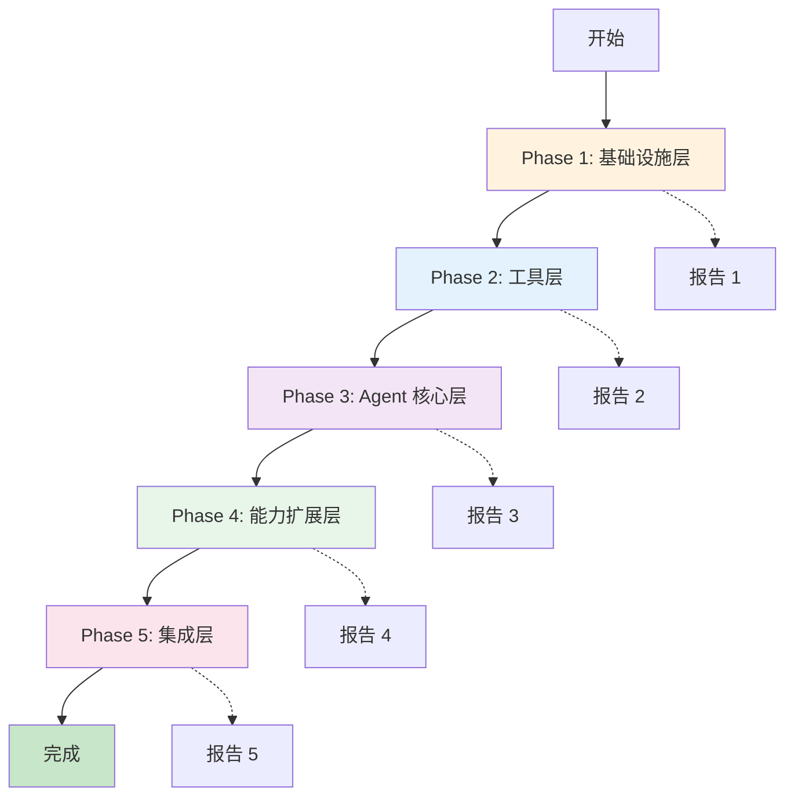

# NaughtyAgent 重构文档

基于 Claude Agent SDK 架构的渐进式重构

## 📚 文档导航

- **[重构路线图](./roadmap.md)** - 完整的 5 个 Phase 计划
- **[Phase 1 计划](./phase-1-plan.md)** - 基础设施层对齐（当前阶段）

## 🎯 重构目标

将现有的 NaughtyAgent 渐进式重构为符合 Claude Agent SDK 规范的架构，同时保持：
- ✅ 功能完整性
- ✅ 向后兼容性
- ✅ 测试覆盖率
- ✅ 代码质量

## 📊 进度概览

```
┌─────────────────────────────────────────────────────────────┐
│                     重构进度                                  │
├─────────────────────────────────────────────────────────────┤
│ Phase 1: 基础设施层对齐    [████░░░░░░] 0%   (8-10天)       │
│ Phase 2: 工具层重构        [░░░░░░░░░░] 0%   (10-12天)      │
│ Phase 3: Agent 核心层重构  [░░░░░░░░░░] 0%   (10-12天)      │
│ Phase 4: 能力扩展层        [░░░░░░░░░░] 0%   (12-15天)      │
│ Phase 5: 集成层更新        [░░░░░░░░░░] 0%   (5-7天)        │
├─────────────────────────────────────────────────────────────┤
│ 总进度                     [░░░░░░░░░░] 0%   (45-56天)      │
└─────────────────────────────────────────────────────────────┘
```

## 🗺️ 重构路径



## 📋 Phase 概览

### Phase 1: 基础设施层对齐 (8-10天)
**状态**: 📋 计划中

**目标**: 让底层基础设施符合 Claude Agent SDK 规范

**主要任务**:
- 消息协议扩展（多模态支持）
- 会话管理增强（分支、标签、成本追踪）
- 错误处理统一（错误分类、重试策略）
- 日志与监控（结构化日志、性能追踪）

---

### Phase 2: 工具层重构 (10-12天)
**状态**: ⏸️ 待开始

**目标**: 工具系统符合 MCP 规范，支持动态发现

**主要任务**:
- 工具接口标准化
- MCP 客户端实现
- 工具发现机制
- 内置工具优化

---

### Phase 3: Agent 核心层重构 (10-12天)
**状态**: ⏸️ 待开始

**目标**: 主循环和执行模式对齐 SDK

**主要任务**:
- Agent 主循环优化
- 流式响应实现
- 执行模式支持（ask_llm, run_agent, fork_agent, run_workflow）
- 实时引导队列

---

### Phase 4: 能力扩展层 (12-15天)
**状态**: ⏸️ 待开始

**目标**: 添加高级功能

**主要任务**:
- 技能系统
- 子代理系统
- 生命周期钩子
- 任务规划

---

### Phase 5: 集成层更新 (5-7天)
**状态**: ⏸️ 待开始

**目标**: VS Code 扩展和 CLI 适配新架构

**主要任务**:
- VS Code 扩展更新
- CLI 更新
- 用户迁移指南

---

## 🎓 设计原则

### 1. 渐进式重构
- 每个 Phase 独立完成
- 保持系统始终可运行
- 小步快跑，快速迭代

### 2. 测试驱动
- 每个改动都有测试
- 保持高覆盖率（80%+）
- 回归测试确保不破坏现有功能

### 3. 向后兼容
- 保持现有 API 不变
- 提供迁移路径
- 标记废弃 API

### 4. 文档先行
- 每个 Phase 有详细计划
- 完成后生成报告
- 记录决策和理由

---

## 📈 质量标准

### 测试覆盖率
- 语句覆盖率 ≥ 80%
- 分支覆盖率 ≥ 75%
- 函数覆盖率 ≥ 85%
- 行覆盖率 ≥ 80%

### 代码质量
- TypeScript 严格模式
- ESLint 无错误
- 统一的代码风格

### 性能要求
- 不低于重构前
- 关键路径优化
- 性能监控到位

---

## 🚀 快速开始

### 1. 查看路线图
```bash
# 阅读完整路线图
cat docs/refactor/roadmap.md
```

### 2. 开始 Phase 1
```bash
# 阅读 Phase 1 计划
cat docs/refactor/phase-1-plan.md

# 创建开发分支
git checkout -b refactor/phase-1

# 运行测试确保基线
pnpm -C packages/agent test
```

### 3. 实施和测试
```bash
# 开发...

# 运行测试
pnpm -C packages/agent test

# 检查覆盖率
pnpm -C packages/agent test:coverage
```

### 4. 生成报告
```bash
# 完成后生成 Phase 报告
# 参考 spec-workflow.md 中的模板
```

---

## 📞 联系和反馈

如有问题或建议，请：
1. 查看相关文档
2. 检查现有代码
3. 提出具体问题

---

## 📚 相关文档

- [整体架构设计](../architecture/01-overall-design.md)
- [项目结构说明](../../.kiro/steering/structure.md)
- [技术栈说明](../../.kiro/steering/tech.md)
- [产品概述](../../.kiro/steering/product.md)
