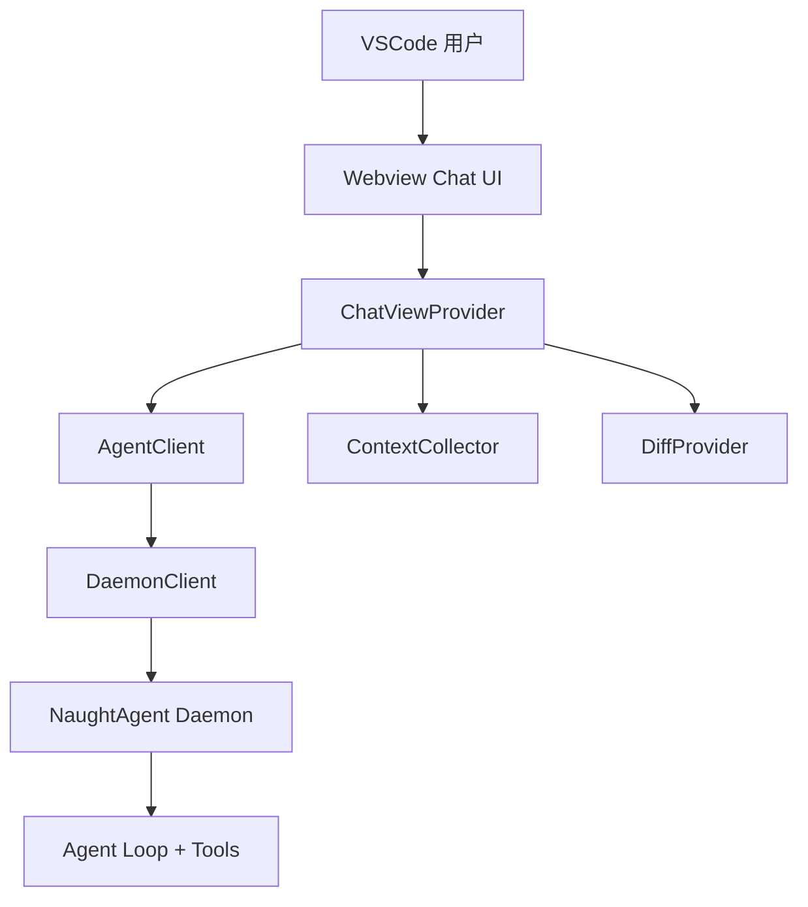

# NaughtAgent VSCode 集成 — 设计文档

> 版本：v1.0 | 日期：2026-04-04 | 对应需求：NaughtAgent-VSCode-Requirements.md

## 1. 设计目标

本设计覆盖三块：
1. **VSCode 插件实现方式**（补齐 Chat Webview + 流式交互 + 权限确认）
2. **CLI 记忆加载完善**（在现有 memory 注入能力上增强 UX）
3. **分阶段迁移计划**（从 v0.1.0 骨架平滑升级到可用版本）

---

## 2. 当前状态与差距

### 2.1 已有能力（可复用）
- `packages/vscode/src/extension.ts`：激活、命令注册、Daemon 连接、会话命令
- `packages/vscode/src/services/AgentClient.ts`：HTTP + WebSocket 通信
- `packages/vscode/src/services/DaemonClient.ts`：Daemon 生命周期管理
- `packages/vscode/src/services/ContextCollector.ts`：编辑器上下文收集
- `packages/vscode/src/services/DiffProvider.ts`：Diff 预览与应用能力
- `packages/vscode/src/views/SessionPicker.ts`：会话选择/创建/删除
- `packages/agent/src/agent/prompt-manager.ts`：已支持 `.naughty/memory.md` 注入系统提示
- `packages/agent/src/tool/memory.ts`：read/write/append 记忆工具已存在

### 2.2 关键缺口
- `ChatViewProvider` 文件不存在，Webview UI 尚未落地
- Webview 前端静态资源（HTML/CSS/JS）不存在
- 没有流式事件到 UI 的桥接层（text/tool/permission）
- CLI 没有显式 `/memory` 命令入口，用户难发现
- 未形成迁移路线图和可执行 task 分解

---

## 3. 目标架构

## 3.1 分层架构



### 3.2 关键设计原则
- **显式触发**：只有用户在 UI 发消息时触发 Agent
- **人工确认**：write/edit/bash 等操作保持确认机制
- **流式优先**：`text_delta` 逐步显示，不做大块缓冲
- **复用优先**：优先复用现有服务模块，避免重写
- **双端一致**：VSCode 与 CLI 对同一 Daemon 协议

---

## 4. VSCode 插件实现设计

### 4.1 ChatViewProvider 设计

新增文件：
- `packages/vscode/src/views/chat/ChatViewProvider.ts`

职责：
- 实现 `vscode.WebviewViewProvider`
- 持有 `AgentClient`、`ContextCollector`、`DiffProvider`
- 处理 UI -> Extension 消息（sendMessage、cancel、permissionResponse）
- 转发 Extension -> UI 事件（text_delta、tool_start、tool_end、done、error）

核心接口：
- `resolveWebviewView(view)`：初始化 webview html + message listener
- `sendMessage(text)`：收集上下文并发起请求
- `handleAgentEvent(event)`：映射后端事件到 UI 事件
- `handlePermissionRequest(req)`：弹框并回传允许/拒绝

### 4.2 Webview 前端设计

新增目录：
- `packages/vscode/src/views/chat/webview/`
  - `index.html`
  - `main.js`
  - `styles.css`

UI 结构：
- 顶部栏：模型、会话、状态（connecting/connected）
- 消息区：user/assistant/tool/thinking 四类卡片
- 输入区：多行输入 + 发送 + 停止
- 工具区：折叠列表（默认折叠长输出）

消息协议（Extension ↔ Webview）：
- UI -> Ext
  - `send_message { text }`
  - `cancel`
  - `permission_response { requestId, allowed }`
- Ext -> UI
  - `session_ready { sessionId }`
  - `assistant_delta { text }`
  - `tool_start { id, name, input }`
  - `tool_end { id, output, isError }`
  - `permission_request { requestId, description }`
  - `done { usage }`
  - `error { message }`

### 4.3 与现有服务的集成

- `AgentClient`：保留现有 HTTP + WS 逻辑，不重构协议
- `DaemonClient`：由 `extension.ts` 继续统一管理连接
- `ContextCollector`：在 `sendMessage` 前拼接 context prompt
- `DiffProvider`：监听工具输出，若可解析 diff 则提示用户预览

### 4.4 命令与配置扩展

扩展命令：
- `naughtyagent.openChat`（已存在，绑定 focus）
- `naughtyagent.clearChat`（已存在，增加状态重置）
- `naughtyagent.cancelTask`（新增）
- `naughtyagent.toggleThinking`（新增）

新增配置：
- `naughtyagent.webview.maxToolOutputLines`（默认 200）
- `naughtyagent.chat.autoScroll`（默认 true）
- `naughtyagent.chat.showThinking`（默认 true）

---

## 5. CLI 记忆完善设计

### 5.1 目标

在不改变现有记忆注入机制前提下，提升可发现性和可操作性。

### 5.2 方案

1. 在 REPL 增加 `/memory` 命令：
- `/memory`：显示当前 memory 概览（前 N 行）
- `/memory edit`：进入简易编辑流程（可先只给出文件路径并提示）
- `/memory add <text>`：追加记忆

2. 启动提示增强：
- 如果 `.naughty/memory.md` 存在，启动时显示 `Memory loaded: X lines`
- 如果不存在，提示可用 `/memory add` 创建

3. 会话结束提示（可选 P2）：
- 在 `onDone` 后提示：是否保存本轮关键结论到 memory

### 5.3 兼容性

- 不修改 `prompt-manager.ts` 的 memory 注入方式
- 不改变 `memory` tool 参数结构
- 保持 Windows / Linux / macOS 一致行为

---

## 6. 数据与状态设计

### 6.1 Chat 状态机

```text
idle -> preparing_context -> streaming -> waiting_permission -> streaming -> done
  \-> error
```

### 6.2 前端状态数据结构

```ts
interface ChatState {
  sessionId?: string
  messages: ChatMessage[]
  pendingPermission?: PermissionRequest
  isStreaming: boolean
  connection: 'connecting' | 'connected' | 'disconnected' | 'error'
}
```

### 6.3 工具输出展示策略

- <= 20 行：默认展开
- > 20 行：默认折叠，显示摘要
- > 200 行：截断并提示打开输出面板

---

## 7. 风险与对策

### 风险 1：Webview 性能问题
- 对策：消息虚拟列表 + 分块渲染 + 限制单条工具输出

### 风险 2：Daemon 断连导致体验差
- 对策：状态栏 + 自动重连 + 明确错误文案

### 风险 3：权限流程阻塞
- 对策：统一 permission 队列，避免并发弹窗冲突

### 风险 4：CLI 与 VSCode 行为不一致
- 对策：复用同一事件类型和工具语义，避免双套协议

---

## 8. 迁移策略（高层）

- Phase 1: 搭建 ChatViewProvider + 基础 Webview（先通消息）
- Phase 2: 接入工具流、权限确认、Diff 预览
- Phase 3: 完善上下文增强、命令增强、状态栏细节
- Phase 4: CLI 记忆 UX 提升与统一测试
- Phase 5: 发布与回归验证

详细任务见 `NaughtAgent-VSCode-Tasks.md`。
